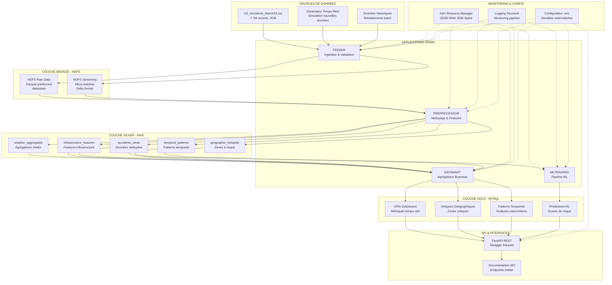

# Architecture Système Global - Lakehouse Accidents US

## 🎯 Objectifs Architecturaux

**Analyses Métier Ciblées :**
- **Analyse Temporelle** : Patterns d'accidents par heure/jour/saison/conditions météo
- **Analyse Géographique** : Cartographie des zones à risque par type d'infrastructure

**Contraintes Techniques :**
- Cluster Hadoop on-premise (HDFS, Hive, Yarn)
- 32GB RAM total, 8GB max Spark
- Dataset 7.7M records, 47 colonnes, 3GB
- Ingestion mixte : streaming + batch + générateur de données
- PySpark uniquement, documentation française

## 🏗️ Architecture Système Global

## 📊 Flux de Données Détaillé

### Couche Bronze (HDFS)
- **Format** : Parquet avec compression Snappy
- **Partitioning** : Par date (YYYY/MM/DD) et état (state)
- **Validation** : Schéma strict des 47 colonnes
- **Rétention** : 2 ans de données historiques

### Couche Silver (Hive)
- **Tables principales** :
  - `accidents_clean` : Données nettoyées et enrichies
  - `weather_aggregated` : Agrégations météorologiques
  - `infrastructure_features` : Features d'infrastructure
  - `temporal_patterns` : Patterns temporels
  - `geographic_hotspots` : Zones à risque géographiques

### Couche Gold (MySQL)
- **Tables optimisées** pour les requêtes API
- **Indexation** sur les colonnes de filtrage fréquentes
- **Agrégations pré-calculées** pour les KPIs
- **Mise à jour** quotidienne via les applications Spark

## 🔄 Applications Spark

### 1. FEEDER
- **Responsabilité** : Ingestion et validation des données
- **Fréquence** : Quotidienne + streaming temps réel
- **Optimisations** : Partitioning intelligent, validation schéma

### 2. PREPROCESSOR
- **Responsabilité** : Nettoyage et feature engineering
- **Fréquence** : Après chaque ingestion
- **Optimisations** : Cache des DataFrames, broadcast des tables de référence

### 3. DATAMART
- **Responsabilité** : Agrégations business et export MySQL
- **Fréquence** : Quotidienne
- **Optimisations** : Bucketing pour jointures, coalesce pour optimiser les fichiers

### 4. MLTRAINING
- **Responsabilité** : Entraînement modèles ML et prédictions
- **Fréquence** : Hebdomadaire pour réentraînement
- **Optimisations** : Cache du dataset d'entraînement, repartition équilibrée

## 🎯 Justifications Architecturales

### Choix du Lakehouse
- **Flexibilité** : Support des données structurées et semi-structurées
- **Performance** : Optimisations Spark pour les gros volumes
- **Évolutivité** : Architecture modulaire extensible
- **Coût** : Utilisation optimale des ressources Hadoop existantes

### Stratégie Multi-Couches
- **Bronze** : Données brutes pour audit et retraitement
- **Silver** : Données nettoyées pour analyses avancées
- **Gold** : Données agrégées pour performance API

### Choix Technologiques
- **PySpark** : Écosystème Python riche pour ML et analyse
- **Hive** : Intégration native avec Hadoop, métadonnées centralisées
- **MySQL** : Performance pour requêtes OLTP de l'API
- **FastAPI** : Performance et documentation automatique