# Stratégie de Gestion de Configuration

## ⚙️ Architecture de Configuration Centralisée

```mermaid
graph LR
    subgraph "Sources de Configuration"
        ENV[.env File<br/>Variables sensibles]
        YAML[Config YAML<br/>Paramètres métier]
        CLI[Arguments CLI<br/>Surcharges runtime]
    end

    subgraph "Gestionnaire Central"
        CONFIG[ConfigManager<br/>Singleton Pattern]
        VALIDATOR[ConfigValidator<br/>Validation schémas]
        LOADER[ConfigLoader<br/>Chargement multi-sources]
    end

    subgraph "Configuration Spécialisée"
        SPARK_CONF[SparkConfig<br/>Optimisations Spark]
        DB_CONF[DatabaseConfig<br/>Connexions DB]
        API_CONF[APIConfig<br/>Configuration FastAPI]
        LOG_CONF[LoggingConfig<br/>Configuration logs]
    end

    subgraph "Applications Consommatrices"
        FEEDER[Feeder App]
        PREPROCESSOR[Preprocessor App]
        DATAMART[Datamart App]
        ML[ML Training App]
        API[FastAPI]
    end

    ENV --> LOADER
    YAML --> LOADER
    CLI --> LOADER
    
    LOADER --> CONFIG
    CONFIG --> VALIDATOR
    
    CONFIG --> SPARK_CONF
    CONFIG --> DB_CONF
    CONFIG --> API_CONF
    CONFIG --> LOG_CONF
    
    SPARK_CONF --> FEEDER
    SPARK_CONF --> PREPROCESSOR
    SPARK_CONF --> DATAMART
    SPARK_CONF --> ML
    
    DB_CONF --> DATAMART
    DB_CONF --> ML
    DB_CONF --> API
    
    API_CONF --> API
    LOG_CONF --> FEEDER
    LOG_CONF --> PREPROCESSOR
    LOG_CONF --> DATAMART
    LOG_CONF --> ML
    LOG_CONF --> API
```



## 🔧 Fichier .env Principal

```bash
# =============================================================================
# CONFIGURATION LAKEHOUSE ACCIDENTS US
# =============================================================================

# -----------------------------------------------------------------------------
# Base de données MySQL (Couche Gold)
# -----------------------------------------------------------------------------
MYSQL_HOST=localhost
MYSQL_PORT=3306
MYSQL_DATABASE=accidents_lakehouse
MYSQL_USER=tatane
MYSQL_PASSWORD=tatane
MYSQL_POOL_SIZE=10
MYSQL_MAX_OVERFLOW=20
MYSQL_POOL_TIMEOUT=30
MYSQL_POOL_RECYCLE=3600

# -----------------------------------------------------------------------------
# Configuration Hadoop/HDFS
# -----------------------------------------------------------------------------
HDFS_NAMENODE=hdfs://localhost:9000
HDFS_BASE_PATH=/lakehouse/accidents
HDFS_REPLICATION_FACTOR=3
HDFS_BLOCK_SIZE=134217728  # 128MB

# Chemins spécifiques par couche
HDFS_BRONZE_PATH=/lakehouse/accidents/bronze
HDFS_SILVER_PATH=/lakehouse/accidents/silver
HDFS_GOLD_PATH=/lakehouse/accidents/gold

# -----------------------------------------------------------------------------
# Configuration Spark
# -----------------------------------------------------------------------------
SPARK_MASTER=yarn
SPARK_APP_NAME=lakehouse-accidents-us
SPARK_DEPLOY_MODE=client

# Configuration mémoire (32GB RAM total disponible)
SPARK_DRIVER_MEMORY=1g
SPARK_DRIVER_MAX_RESULT_SIZE=512m
SPARK_EXECUTOR_MEMORY=2g
SPARK_EXECUTOR_CORES=2
SPARK_EXECUTOR_INSTANCES=4

# Allocation dynamique
SPARK_DYNAMIC_ALLOCATION_ENABLED=true
SPARK_DYNAMIC_ALLOCATION_MIN_EXECUTORS=1
SPARK_DYNAMIC_ALLOCATION_MAX_EXECUTORS=4
SPARK_DYNAMIC_ALLOCATION_INITIAL_EXECUTORS=2

# Configuration SQL
SPARK_SQL_ADAPTIVE_ENABLED=true
SPARK_SQL_ADAPTIVE_COALESCE_PARTITIONS_ENABLED=true
SPARK_SQL_ADAPTIVE_SKEW_JOIN_ENABLED=true
SPARK_SQL_SHUFFLE_PARTITIONS=200

# Sérialisation et optimisations
SPARK_SERIALIZER=org.apache.spark.serializer.KryoSerializer
SPARK_SQL_EXECUTION_ARROW_PYSPARK_ENABLED=true

# -----------------------------------------------------------------------------
# Configuration Hive (Couche Silver)
# -----------------------------------------------------------------------------
HIVE_METASTORE_URI=thrift://localhost:9083
HIVE_DATABASE=accidents_warehouse
HIVE_WAREHOUSE_DIR=/user/hive/warehouse

# Tables Hive principales
HIVE_TABLE_ACCIDENTS_CLEAN=accidents_clean
HIVE_TABLE_WEATHER_AGGREGATED=weather_aggregated
HIVE_TABLE_INFRASTRUCTURE_FEATURES=infrastructure_features
HIVE_TABLE_TEMPORAL_PATTERNS=temporal_patterns
HIVE_TABLE_GEOGRAPHIC_HOTSPOTS=geographic_hotspots

# -----------------------------------------------------------------------------
# Configuration API FastAPI
# -----------------------------------------------------------------------------
API_HOST=0.0.0.0
API_PORT=8000
API_TITLE=Lakehouse Accidents US API
API_DESCRIPTION=API d'analyse des accidents de la route aux États-Unis
API_VERSION=1.0.0
API_SECRET_KEY=your-super-secret-key-change-in-production
API_ACCESS_TOKEN_EXPIRE_MINUTES=30

# Configuration CORS
API_CORS_ORIGINS=["http://localhost:3000", "http://localhost:8080"]
API_CORS_ALLOW_CREDENTIALS=true
API_CORS_ALLOW_METHODS=["GET", "POST", "PUT", "DELETE"]
API_CORS_ALLOW_HEADERS=["*"]

# Pagination par défaut
API_DEFAULT_PAGE_SIZE=100
API_MAX_PAGE_SIZE=1000

# -----------------------------------------------------------------------------
# Configuration Logging
# -----------------------------------------------------------------------------
LOG_LEVEL=INFO
LOG_FORMAT=json
LOG_FILE_PATH=/var/log/lakehouse-accidents
LOG_FILE_MAX_SIZE=100MB
LOG_FILE_BACKUP_COUNT=5
LOG_ROTATION=daily

# Logging par application
LOG_FEEDER_LEVEL=INFO
LOG_PREPROCESSOR_LEVEL=INFO
LOG_DATAMART_LEVEL=INFO
LOG_ML_TRAINING_LEVEL=INFO
LOG_API_LEVEL=INFO

# -----------------------------------------------------------------------------
# Configuration MLflow
# -----------------------------------------------------------------------------
MLFLOW_TRACKING_URI=http://localhost:5000
MLFLOW_EXPERIMENT_NAME=accidents-severity-prediction
MLFLOW_ARTIFACT_ROOT=/mlflow/artifacts
MLFLOW_DEFAULT_ARTIFACT_ROOT=/mlflow/artifacts

# -----------------------------------------------------------------------------
# Configuration Monitoring
# -----------------------------------------------------------------------------
MONITORING_ENABLED=true
METRICS_PORT=9090
HEALTH_CHECK_INTERVAL=30
PERFORMANCE_MONITORING_ENABLED=true

# Seuils d'alerte
ALERT_MEMORY_THRESHOLD=80
ALERT_CPU_THRESHOLD=85
ALERT_DISK_THRESHOLD=90
ALERT_ERROR_RATE_THRESHOLD=5

# -----------------------------------------------------------------------------
# Configuration Données
# -----------------------------------------------------------------------------
# Dataset principal
DATA_SOURCE_PATH=/data/raw/US_Accidents_March23.csv
DATA_EXPECTED_COLUMNS=47
DATA_EXPECTED_ROWS=7700000

# Partitioning
PARTITION_COLUMNS=["date", "state"]
BUCKETING_COLUMNS=["state", "county"]
BUCKETING_NUM_BUCKETS=50

# Compression
COMPRESSION_CODEC=snappy
PARQUET_COMPRESSION=snappy

# -----------------------------------------------------------------------------
# Configuration Générateur de Données
# -----------------------------------------------------------------------------
GENERATOR_ENABLED=true
GENERATOR_INTERVAL_SECONDS=60
GENERATOR_BATCH_SIZE=100
GENERATOR_SIMULATION_SPEED=1.0

# -----------------------------------------------------------------------------
# Configuration Sécurité
# -----------------------------------------------------------------------------
SECURITY_ENABLED=true
JWT_SECRET_KEY=your-jwt-secret-key
JWT_ALGORITHM=HS256
JWT_ACCESS_TOKEN_EXPIRE_MINUTES=30

# -----------------------------------------------------------------------------
# Configuration Environnement
# -----------------------------------------------------------------------------
ENVIRONMENT=development  # development, staging, production
DEBUG=true
TESTING=false
```

## 🏗️ Classes de Configuration

### ConfigManager - Gestionnaire Principal

```python
# config/config_manager.py
import os
from typing import Dict, Any, Optional
from pathlib import Path
from dotenv import load_dotenv
import yaml
from dataclasses import dataclass

class ConfigManager:
    """Gestionnaire centralisé de configuration avec pattern Singleton"""
    
    _instance: Optional['ConfigManager'] = None
    _config: Optional[Dict[str, Any]] = None
    
    def __new__(cls) -> 'ConfigManager':
        if cls._instance is None:
            cls._instance = super().__new__(cls)
        return cls._instance
    
    def __init__(self):
        if self._config is None:
            self._load_configuration()
    
    def _load_configuration(self) -> None:
        """Charge la configuration depuis multiples sources"""
        # 1. Charger les variables d'environnement
        load_dotenv()
        
        # 2. Charger la configuration YAML si elle existe
        config_file = Path("config/base.yaml")
        yaml_config = {}
        if config_file.exists():
            with open(config_file, 'r', encoding='utf-8') as f:
                yaml_config = yaml.safe_load(f) or {}
        
        # 3. Fusionner les configurations (env vars prioritaires)
        self._config = {
            **yaml_config,
            **self._get_env_config()
        }
        
        # 4. Valider la configuration
        self._validate_config()
    
    def _get_env_config(self) -> Dict[str, Any]:
        """Extrait la configuration depuis les variables d'environnement"""
        return {
            # MySQL
            'mysql': {
                'host': os.getenv('MYSQL_HOST', 'localhost'),
                'port': int(os.getenv('MYSQL_PORT', '3306')),
                'database': os.getenv('MYSQL_DATABASE', 'accidents_lakehouse'),
                'user': os.getenv('MYSQL_USER', 'tatane'),
                'password': os.getenv('MYSQL_PASSWORD', 'tatane'),
                'pool_size': int(os.getenv('MYSQL_POOL_SIZE', '10')),
                'max_overflow': int(os.getenv('MYSQL_MAX_OVERFLOW', '20')),
            },
            
            # HDFS
            'hdfs': {
                'namenode': os.getenv('HDFS_NAMENODE', 'hdfs://localhost:9000'),
                'base_path': os.getenv('HDFS_BASE_PATH', '/lakehouse/accidents'),
                'bronze_path': os.getenv('HDFS_BRONZE_PATH', '/lakehouse/accidents/bronze'),
                'silver_path': os.getenv('HDFS_SILVER_PATH', '/lakehouse/accidents/silver'),
                'gold_path': os.getenv('HDFS_GOLD_PATH', '/lakehouse/accidents/gold'),
                'replication_factor': int(os.getenv('HDFS_REPLICATION_FACTOR', '3')),
            },
            
            # Spark
            'spark': {
                'master': os.getenv('SPARK_MASTER', 'yarn'),
                'app_name': os.getenv('SPARK_APP_NAME', 'lakehouse-accidents-us'),
                'driver_memory': os.getenv('SPARK_DRIVER_MEMORY', '1g'),
                'executor_memory': os.getenv('SPARK_EXECUTOR_MEMORY', '2g'),
                'executor_cores': int(os.getenv('SPARK_EXECUTOR_CORES', '2')),
                'max_executors': int(os.getenv('SPARK_DYNAMIC_ALLOCATION_MAX_EXECUTORS', '4')),
                'sql_shuffle_partitions': int(os.getenv('SPARK_SQL_SHUFFLE_PARTITIONS', '200')),
            },
            
            # API
            'api': {
                'host': os.getenv('API_HOST', '0.0.0.0'),
                'port': int(os.getenv('API_PORT', '8000')),
                'title': os.getenv('API_TITLE', 'Lakehouse Accidents US API'),
                'secret_key': os.getenv('API_SECRET_KEY', 'change-me-in-production'),
                'default_page_size': int(os.getenv('API_DEFAULT_PAGE_SIZE', '100')),
                'max_page_size': int(os.getenv('API_MAX_PAGE_SIZE', '1000')),
            },
            
            # Logging
            'logging': {
                'level': os.getenv('LOG_LEVEL', 'INFO'),
                'format': os.getenv('LOG_FORMAT', 'json'),
                'file_path': os.getenv('LOG_FILE_PATH', '/var/log/lakehouse-accidents'),
                'max_size': os.getenv('LOG_FILE_MAX_SIZE', '100MB'),
            },
            
            # Données
            'data': {
                'source_path': os.getenv('DATA_SOURCE_PATH', '/data/raw/US_Accidents_March23.csv'),
                'expected_columns': int(os.getenv('DATA_EXPECTED_COLUMNS', '47')),
                'partition_columns': ['date', 'state'],
                'compression_codec': os.getenv('COMPRESSION_CODEC', 'snappy'),
            },
            
            # Environnement
            'environment': os.getenv('ENVIRONMENT', 'development'),
            'debug': os.getenv('DEBUG', 'true').lower() == 'true',
        }
    
    def _validate_config(self) -> None:
        """Valide la cohérence de la configuration"""
        required_keys = [
            'mysql.host', 'mysql.user', 'mysql.password',
            'hdfs.namenode', 'spark.master',
            'api.secret_key'
        ]
        
        for key in required_keys:
            if not self._get_nested_value(key):
                raise ValueError(f"Configuration manquante: {key}")
    
    def _get_nested_value(self, key: str) -> Any:
        """Récupère une valeur imbriquée avec notation pointée"""
        keys = key.split('.')
        value = self._config
        for k in keys:
            if isinstance(value, dict) and k in value:
                value = value[k]
            else:
                return None
        return value
    
    def get(self, key: str, default: Any = None) -> Any:
        """Récupère une valeur de configuration"""
        return self._get_nested_value(key) or default
    
    def get_mysql_url(self) -> str:
        """Construit l'URL de connexion MySQL"""
        mysql_config = self._config['mysql']
        return (f"mysql+pymysql://{mysql_config['user']}:{mysql_config['password']}"
                f"@{mysql_config['host']}:{mysql_config['port']}/{mysql_config['database']}")
    
    def get_hdfs_path(self, layer: str = 'bronze') -> str:
        """Récupère le chemin HDFS pour une couche donnée"""
        hdfs_config = self._config['hdfs']
        return hdfs_config.get(f'{layer}_path', hdfs_config['base_path'])
    
    def get_spark_config(self) -> Dict[str, str]:
        """Récupère la configuration Spark complète"""
        spark_config = self._config['spark']
        return {
            'spark.master': spark_config['master'],
            'spark.app.name': spark_config['app_name'],
            'spark.driver.memory': spark_config['driver_memory'],
            'spark.executor.memory': spark_config['executor_memory'],
            'spark.executor.cores': str(spark_config['executor_cores']),
            'spark.dynamicAllocation.maxExecutors': str(spark_config['max_executors']),
            'spark.sql.shuffle.partitions': str(spark_config['sql_shuffle_partitions']),
            'spark.serializer': 'org.apache.spark.serializer.KryoSerializer',
            'spark.sql.adaptive.enabled': 'true',
            'spark.sql.adaptive.coalescePartitions.enabled': 'true',
        }
```

### SparkConfig - Configuration Spécialisée Spark

```python
# config/spark_config.py
from typing import Dict, Any
from .config_manager import ConfigManager

class SparkConfig:
    """Configuration spécialisée pour Spark avec optimisations"""
    
    def __init__(self, config_manager: ConfigManager):
        self.config_manager = config_manager
        self._base_config = config_manager.get_spark_config()
    
    def get_feeder_config(self) -> Dict[str, str]:
        """Configuration optimisée pour l'application Feeder"""
        config = self._base_config.copy()
        config.update({
            'spark.app.name': 'lakehouse-accidents-feeder',
            'spark.sql.adaptive.coalescePartitions.enabled': 'true',
            'spark.sql.files.maxPartitionBytes': '134217728',  # 128MB
            'spark.sql.adaptive.advisoryPartitionSizeInBytes': '67108864',  # 64MB
        })
        return config
    
    def get_preprocessor_config(self) -> Dict[str, str]:
        """Configuration optimisée pour l'application Preprocessor"""
        config = self._base_config.copy()
        config.update({
            'spark.app.name': 'lakehouse-accidents-preprocessor',
            'spark.sql.adaptive.skewJoin.enabled': 'true',
            'spark.sql.adaptive.localShuffleReader.enabled': 'true',
            'spark.sql.cache.serializer': 'org.apache.spark.sql.execution.columnar.InMemoryTableScanExec',
        })
        return config
    
    def get_datamart_config(self) -> Dict[str, str]:
        """Configuration optimisée pour l'application Datamart"""
        config = self._base_config.copy()
        config.update({
            'spark.app.name': 'lakehouse-accidents-datamart',
            'spark.sql.adaptive.coalescePartitions.enabled': 'true',
            'spark.sql.adaptive.coalescePartitions.minPartitionNum': '1',
            'spark.sql.execution.arrow.maxRecordsPerBatch': '10000',
        })
        return config
    
    def get_ml_training_config(self) -> Dict[str, str]:
        """Configuration optimisée pour l'application ML Training"""
        config = self._base_config.copy()
        config.update({
            'spark.app.name': 'lakehouse-accidents-ml-training',
            'spark.executor.memory': '3g',  # Plus de mémoire pour ML
            'spark.driver.memory': '2g',
            'spark.sql.execution.arrow.pyspark.enabled': 'true',
            'spark.sql.execution.arrow.maxRecordsPerBatch': '10000',
        })
        return config
```

### DatabaseConfig - Configuration Base de Données

```python
# config/database_config.py
from sqlalchemy import create_engine
from sqlalchemy.pool import QueuePool
from .config_manager import ConfigManager

class DatabaseConfig:
    """Configuration spécialisée pour les bases de données"""
    
    def __init__(self, config_manager: ConfigManager):
        self.config_manager = config_manager
        self._mysql_config = config_manager.get('mysql')
    
    def create_mysql_engine(self):
        """Crée un moteur SQLAlchemy pour MySQL avec pool de connexions"""
        url = self.config_manager.get_mysql_url()
        
        return create_engine(
            url,
            poolclass=QueuePool,
            pool_size=self._mysql_config['pool_size'],
            max_overflow=self._mysql_config['max_overflow'],
            pool_timeout=30,
            pool_recycle=3600,
            echo=self.config_manager.get('debug', False)
        )
    
    def get_hive_connection_params(self) -> Dict[str, Any]:
        """Paramètres de connexion Hive"""
        return {
            'host': 'localhost',
            'port': 10000,
            'database': self.config_manager.get('hive.database', 'accidents_warehouse'),
            'auth': 'NOSASL'
        }
```

## 🔒 Gestion des Secrets

### Fichiers de Secrets par Environnement

```bash
# config/secrets/dev_secrets.env
MYSQL_PASSWORD=dev_password
API_SECRET_KEY=dev-secret-key-not-for-production
JWT_SECRET_KEY=dev-jwt-secret

# config/secrets/prod_secrets.env
MYSQL_PASSWORD=${VAULT_MYSQL_PASSWORD}
API_SECRET_KEY=${VAULT_API_SECRET_KEY}
JWT_SECRET_KEY=${VAULT_JWT_SECRET_KEY}
```

### Chargement Sécurisé

```python
def load_secrets(environment: str) -> None:
    """Charge les secrets selon l'environnement"""
    secrets_file = f"config/secrets/{environment}_secrets.env"
    if Path(secrets_file).exists():
        load_dotenv(secrets_file, override=True)
```

## 📊 Configuration par Environnement

### Surcharges par Environnement

```yaml
# config/development.yaml
spark:
  executor_instances: 2
  log_level: DEBUG

api:
  debug: true
  reload: true

logging:
  level: DEBUG
  console_output: true

# config/production.yaml
spark:
  executor_instances: 4
  log_level: WARN

api:
  debug: false
  reload: false

logging:
  level: INFO
  console_output: false
  file_rotation: daily
```

## 🎯 Validation et Monitoring Configuration

### Validation au Démarrage

```python
class ConfigValidator:
    """Validateur de configuration avec règles métier"""
    
    @staticmethod
    def validate_spark_memory(config: Dict[str, Any]) -> None:
        """Valide que la configuration mémoire Spark est cohérente"""
        total_memory = 32 * 1024  # 32GB en MB
        driver_memory = parse_memory(config['spark']['driver_memory'])
        executor_memory = parse_memory(config['spark']['executor_memory'])
        max_executors = config['spark']['max_executors']
        
        total_used = driver_memory + (executor_memory * max_executors)
        
        if total_used > total_memory:
            raise ValueError(f"Configuration mémoire dépasse la capacité: {total_used}MB > {total_memory}MB")
    
    @staticmethod
    def validate_database_connectivity(config: Dict[str, Any]) -> None:
        """Valide la connectivité aux bases de données"""
        # Test connexion MySQL
        # Test connexion Hive
        pass
```

Cette stratégie de configuration garantit une gestion centralisée, sécurisée et flexible de tous les paramètres du système lakehouse.