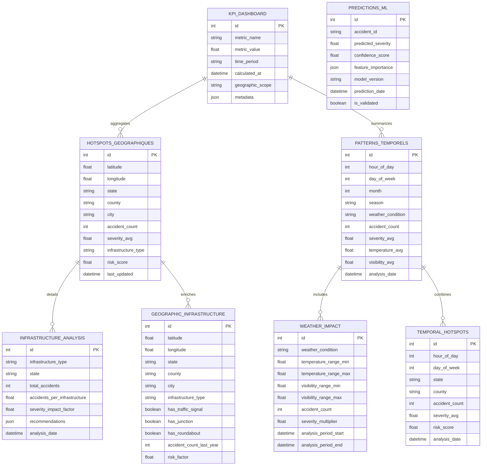

# Schéma Base de Données MySQL - Couche Gold

## 🗄️ Architecture Base de Données



## 📊 Tables Principales

### 1. KPI_DASHBOARD - Tableau de Bord des Indicateurs

```sql
CREATE TABLE kpi_dashboard (
    id INT AUTO_INCREMENT PRIMARY KEY,
    metric_name VARCHAR(100) NOT NULL COMMENT 'Nom de la métrique (accidents_par_heure, severite_moyenne, etc.)',
    metric_value DECIMAL(15,4) NOT NULL COMMENT 'Valeur de la métrique',
    time_period VARCHAR(50) NOT NULL COMMENT 'Période temporelle (daily, weekly, monthly, yearly)',
    calculated_at TIMESTAMP DEFAULT CURRENT_TIMESTAMP COMMENT 'Date de calcul',
    geographic_scope VARCHAR(100) COMMENT 'Portée géographique (state, county, city)',
    metadata JSON COMMENT 'Métadonnées additionnelles en JSON',
    
    -- Index pour optimiser les requêtes API fréquentes
    INDEX idx_metric_time (metric_name, time_period),
    INDEX idx_calculated_at (calculated_at DESC),
    INDEX idx_geographic (geographic_scope),
    INDEX idx_metric_geo_time (metric_name, geographic_scope, time_period)
) ENGINE=InnoDB 
  DEFAULT CHARSET=utf8mb4 
  COLLATE=utf8mb4_unicode_ci
  COMMENT='Tableau de bord des KPIs pour l\'API';
```

**Métriques Stockées :**
- `accidents_par_heure` : Nombre d'accidents par heure
- `severite_moyenne` : Sévérité moyenne des accidents
- `hotspots_count` : Nombre de zones à risque
- `weather_impact_factor` : Facteur d'impact météorologique
- `infrastructure_risk_score` : Score de risque par infrastructure

### 2. HOTSPOTS_GEOGRAPHIQUES - Zones à Risque

```sql
CREATE TABLE hotspots_geographiques (
    id INT AUTO_INCREMENT PRIMARY KEY,
    latitude DECIMAL(10,8) NOT NULL COMMENT 'Latitude du hotspot',
    longitude DECIMAL(11,8) NOT NULL COMMENT 'Longitude du hotspot',
    state VARCHAR(2) NOT NULL COMMENT 'Code état (ex: OH, CA)',
    county VARCHAR(100) COMMENT 'Nom du comté',
    city VARCHAR(100) COMMENT 'Nom de la ville',
    accident_count INT DEFAULT 0 COMMENT 'Nombre d\'accidents dans la zone',
    severity_avg DECIMAL(3,2) COMMENT 'Sévérité moyenne (1.00-4.00)',
    infrastructure_type VARCHAR(50) COMMENT 'Type d\'infrastructure dominante',
    risk_score DECIMAL(5,4) NOT NULL COMMENT 'Score de risque (0.0000-1.0000)',
    radius_meters INT DEFAULT 1000 COMMENT 'Rayon de la zone en mètres',
    last_updated TIMESTAMP DEFAULT CURRENT_TIMESTAMP ON UPDATE CURRENT_TIMESTAMP,
    
    -- Index géospatial pour requêtes de proximité
    SPATIAL INDEX idx_location (latitude, longitude),
    INDEX idx_state_county (state, county),
    INDEX idx_risk_score (risk_score DESC),
    INDEX idx_infrastructure (infrastructure_type),
    INDEX idx_accident_count (accident_count DESC),
    INDEX idx_last_updated (last_updated DESC)
) ENGINE=InnoDB 
  DEFAULT CHARSET=utf8mb4 
  COLLATE=utf8mb4_unicode_ci
  COMMENT='Zones géographiques à haut risque d\'accidents';
```

### 3. PATTERNS_TEMPORELS - Analyses Temporelles

```sql
CREATE TABLE patterns_temporels (
    id INT AUTO_INCREMENT PRIMARY KEY,
    hour_of_day TINYINT NOT NULL COMMENT 'Heure de la journée (0-23)',
    day_of_week TINYINT NOT NULL COMMENT 'Jour de la semaine (1=Lundi, 7=Dimanche)',
    month TINYINT NOT NULL COMMENT 'Mois (1-12)',
    season ENUM('spring', 'summer', 'autumn', 'winter') NOT NULL COMMENT 'Saison',
    weather_condition VARCHAR(100) COMMENT 'Condition météorologique',
    accident_count INT DEFAULT 0 COMMENT 'Nombre d\'accidents',
    severity_avg DECIMAL(3,2) COMMENT 'Sévérité moyenne',
    temperature_avg DECIMAL(5,2) COMMENT 'Température moyenne (°F)',
    visibility_avg DECIMAL(5,2) COMMENT 'Visibilité moyenne (miles)',
    humidity_avg DECIMAL(5,2) COMMENT 'Humidité moyenne (%)',
    wind_speed_avg DECIMAL(5,2) COMMENT 'Vitesse du vent moyenne (mph)',
    analysis_date DATE NOT NULL COMMENT 'Date d\'analyse',
    
    -- Index pour requêtes temporelles
    INDEX idx_temporal (hour_of_day, day_of_week, month),
    INDEX idx_season_weather (season, weather_condition),
    INDEX idx_analysis_date (analysis_date DESC),
    INDEX idx_accident_count (accident_count DESC),
    INDEX idx_severity (severity_avg DESC),
    
    -- Index composé pour analyses croisées
    INDEX idx_time_weather (hour_of_day, weather_condition),
    INDEX idx_season_severity (season, severity_avg DESC)
) ENGINE=InnoDB 
  DEFAULT CHARSET=utf8mb4 
  COLLATE=utf8mb4_unicode_ci
  COMMENT='Patterns temporels des accidents';
```

### 4. PREDICTIONS_ML - Prédictions Machine Learning

```sql
CREATE TABLE predictions_ml (
    id INT AUTO_INCREMENT PRIMARY KEY,
    accident_id VARCHAR(50) COMMENT 'ID de l\'accident (si existant)',
    predicted_severity DECIMAL(3,2) NOT NULL COMMENT 'Sévérité prédite (1.00-4.00)',
    confidence_score DECIMAL(5,4) NOT NULL COMMENT 'Score de confiance (0.0000-1.0000)',
    feature_importance JSON COMMENT 'Importance des features en JSON',
    model_version VARCHAR(50) NOT NULL COMMENT 'Version du modèle utilisé',
    model_type VARCHAR(50) DEFAULT 'RandomForest' COMMENT 'Type de modèle ML',
    prediction_date TIMESTAMP DEFAULT CURRENT_TIMESTAMP COMMENT 'Date de prédiction',
    is_validated BOOLEAN DEFAULT FALSE COMMENT 'Prédiction validée par observation',
    actual_severity DECIMAL(3,2) COMMENT 'Sévérité réelle (si connue)',
    
    -- Données d'entrée pour la prédiction
    input_latitude DECIMAL(10,8) COMMENT 'Latitude d\'entrée',
    input_longitude DECIMAL(11,8) COMMENT 'Longitude d\'entrée',
    input_weather_condition VARCHAR(100) COMMENT 'Condition météo d\'entrée',
    input_temperature DECIMAL(5,2) COMMENT 'Température d\'entrée',
    input_hour TINYINT COMMENT 'Heure d\'entrée',
    input_infrastructure_type VARCHAR(50) COMMENT 'Type d\'infrastructure',
    
    INDEX idx_model_version (model_version),
    INDEX idx_prediction_date (prediction_date DESC),
    INDEX idx_confidence (confidence_score DESC),
    INDEX idx_predicted_severity (predicted_severity DESC),
    INDEX idx_validation (is_validated, actual_severity),
    INDEX idx_input_location (input_latitude, input_longitude)
) ENGINE=InnoDB 
  DEFAULT CHARSET=utf8mb4 
  COLLATE=utf8mb4_unicode_ci
  COMMENT='Prédictions de sévérité par ML';
```

### 5. INFRASTRUCTURE_ANALYSIS - Analyse des Infrastructures

```sql
CREATE TABLE infrastructure_analysis (
    id INT AUTO_INCREMENT PRIMARY KEY,
    infrastructure_type VARCHAR(50) NOT NULL COMMENT 'Type d\'infrastructure',
    state VARCHAR(2) NOT NULL COMMENT 'État',
    county VARCHAR(100) COMMENT 'Comté',
    total_accidents INT DEFAULT 0 COMMENT 'Total accidents sur cette infrastructure',
    accidents_per_infrastructure DECIMAL(8,4) COMMENT 'Accidents par unité d\'infrastructure',
    severity_impact_factor DECIMAL(5,4) COMMENT 'Facteur d\'impact sur la sévérité',
    recommendations JSON COMMENT 'Recommandations d\'amélioration',
    analysis_date DATE NOT NULL COMMENT 'Date d\'analyse',
    
    -- Statistiques détaillées
    avg_severity DECIMAL(3,2) COMMENT 'Sévérité moyenne',
    peak_hour TINYINT COMMENT 'Heure de pic d\'accidents',
    weather_correlation DECIMAL(5,4) COMMENT 'Corrélation avec météo',
    
    INDEX idx_infrastructure_state (infrastructure_type, state),
    INDEX idx_analysis_date (analysis_date DESC),
    INDEX idx_severity_impact (severity_impact_factor DESC),
    INDEX idx_accidents_per_infra (accidents_per_infrastructure DESC),
    
    UNIQUE KEY uk_infra_state_county_date (infrastructure_type, state, county, analysis_date)
) ENGINE=InnoDB 
  DEFAULT CHARSET=utf8mb4 
  COLLATE=utf8mb4_unicode_ci
  COMMENT='Analyse des infrastructures routières';
```

### 6. WEATHER_IMPACT - Impact Météorologique

```sql
CREATE TABLE weather_impact (
    id INT AUTO_INCREMENT PRIMARY KEY,
    weather_condition VARCHAR(100) NOT NULL COMMENT 'Condition météorologique',
    temperature_range_min DECIMAL(5,2) COMMENT 'Température minimale (°F)',
    temperature_range_max DECIMAL(5,2) COMMENT 'Température maximale (°F)',
    visibility_range_min DECIMAL(5,2) COMMENT 'Visibilité minimale (miles)',
    visibility_range_max DECIMAL(5,2) COMMENT 'Visibilité maximale (miles)',
    humidity_range_min DECIMAL(5,2) COMMENT 'Humidité minimale (%)',
    humidity_range_max DECIMAL(5,2) COMMENT 'Humidité maximale (%)',
    accident_count INT DEFAULT 0 COMMENT 'Nombre d\'accidents',
    severity_multiplier DECIMAL(5,4) DEFAULT 1.0000 COMMENT 'Multiplicateur de sévérité',
    analysis_period_start DATE NOT NULL COMMENT 'Début période d\'analyse',
    analysis_period_end DATE NOT NULL COMMENT 'Fin période d\'analyse',
    
    -- Statistiques par état
    state_breakdown JSON COMMENT 'Répartition par état en JSON',
    
    INDEX idx_weather_condition (weather_condition),
    INDEX idx_analysis_period (analysis_period_start, analysis_period_end),
    INDEX idx_severity_multiplier (severity_multiplier DESC),
    INDEX idx_accident_count (accident_count DESC),
    INDEX idx_temperature_range (temperature_range_min, temperature_range_max),
    INDEX idx_visibility_range (visibility_range_min, visibility_range_max)
) ENGINE=InnoDB 
  DEFAULT CHARSET=utf8mb4 
  COLLATE=utf8mb4_unicode_ci
  COMMENT='Impact des conditions météorologiques';
```

## 🔧 Scripts de Création et Optimisation

### Script de Création Complète

```sql
-- scripts/database/create_mysql_tables.sql

-- Configuration de la base de données
SET NAMES utf8mb4;
SET FOREIGN_KEY_CHECKS = 0;

-- Création de la base de données si elle n'existe pas
CREATE DATABASE IF NOT EXISTS accidents_lakehouse 
    DEFAULT CHARACTER SET utf8mb4 
    DEFAULT COLLATE utf8mb4_unicode_ci;

USE accidents_lakehouse;

-- Table KPI Dashboard
CREATE TABLE IF NOT EXISTS kpi_dashboard (
    id INT AUTO_INCREMENT PRIMARY KEY,
    metric_name VARCHAR(100) NOT NULL,
    metric_value DECIMAL(15,4) NOT NULL,
    time_period VARCHAR(50) NOT NULL,
    calculated_at TIMESTAMP DEFAULT CURRENT_TIMESTAMP,
    geographic_scope VARCHAR(100),
    metadata JSON,
    
    INDEX idx_metric_time (metric_name, time_period),
    INDEX idx_calculated_at (calculated_at DESC),
    INDEX idx_geographic (geographic_scope),
    INDEX idx_metric_geo_time (metric_name, geographic_scope, time_period)
) ENGINE=InnoDB DEFAULT CHARSET=utf8mb4 COLLATE=utf8mb4_unicode_ci;

-- Table Hotspots Géographiques
CREATE TABLE IF NOT EXISTS hotspots_geographiques (
    id INT AUTO_INCREMENT PRIMARY KEY,
    latitude DECIMAL(10,8) NOT NULL,
    longitude DECIMAL(11,8) NOT NULL,
    state VARCHAR(2) NOT NULL,
    county VARCHAR(100),
    city VARCHAR(100),
    accident_count INT DEFAULT 0,
    severity_avg DECIMAL(3,2),
    infrastructure_type VARCHAR(50),
    risk_score DECIMAL(5,4) NOT NULL,
    radius_meters INT DEFAULT 1000,
    last_updated TIMESTAMP DEFAULT CURRENT_TIMESTAMP ON UPDATE CURRENT_TIMESTAMP,
    
    SPATIAL INDEX idx_location (latitude, longitude),
    INDEX idx_state_county (state, county),
    INDEX idx_risk_score (risk_score DESC),
    INDEX idx_infrastructure (infrastructure_type),
    INDEX idx_accident_count (accident_count DESC)
) ENGINE=InnoDB DEFAULT CHARSET=utf8mb4 COLLATE=utf8mb4_unicode_ci;

-- [Autres tables...]

-- Activation des contraintes de clés étrangères
SET FOREIGN_KEY_CHECKS = 1;
```

### Script d'Optimisation des Index

```sql
-- scripts/database/optimize_indexes.sql

-- Analyse des performances des requêtes
ANALYZE TABLE kpi_dashboard, hotspots_geographiques, patterns_temporels, 
             predictions_ml, infrastructure_analysis, weather_impact;

-- Optimisation des tables
OPTIMIZE TABLE kpi_dashboard, hotspots_geographiques, patterns_temporels,
               predictions_ml, infrastructure_analysis, weather_impact;

-- Index composés pour requêtes API fréquentes
ALTER TABLE hotspots_geographiques 
ADD INDEX idx_state_risk_count (state, risk_score DESC, accident_count DESC);

ALTER TABLE patterns_temporels 
ADD INDEX idx_hour_day_severity (hour_of_day, day_of_week, severity_avg DESC);

-- Index pour pagination efficace
ALTER TABLE kpi_dashboard 
ADD INDEX idx_pagination (metric_name, calculated_at DESC, id);

-- Index pour recherche géographique avancée
ALTER TABLE hotspots_geographiques 
ADD INDEX idx_geo_search (state, county, city, risk_score DESC);
```

## 📈 Stratégies d'Optimisation

### 1. Partitioning par Date

```sql
-- Partitioning de la table KPI_DASHBOARD par mois
ALTER TABLE kpi_dashboard 
PARTITION BY RANGE (YEAR(calculated_at) * 100 + MONTH(calculated_at)) (
    PARTITION p202401 VALUES LESS THAN (202402),
    PARTITION p202402 VALUES LESS THAN (202403),
    PARTITION p202403 VALUES LESS THAN (202404),
    -- ... autres partitions
    PARTITION p_future VALUES LESS THAN MAXVALUE
);
```

### 2. Archivage Automatique

```sql
-- Procédure d'archivage des anciennes données
DELIMITER //
CREATE PROCEDURE ArchiveOldData()
BEGIN
    -- Archiver les KPIs de plus de 2 ans
    INSERT INTO kpi_dashboard_archive 
    SELECT * FROM kpi_dashboard 
    WHERE calculated_at < DATE_SUB(NOW(), INTERVAL 2 YEAR);
    
    DELETE FROM kpi_dashboard 
    WHERE calculated_at < DATE_SUB(NOW(), INTERVAL 2 YEAR);
    
    -- Archiver les prédictions validées de plus de 1 an
    INSERT INTO predictions_ml_archive 
    SELECT * FROM predictions_ml 
    WHERE prediction_date < DATE_SUB(NOW(), INTERVAL 1 YEAR) 
    AND is_validated = TRUE;
    
    DELETE FROM predictions_ml 
    WHERE prediction_date < DATE_SUB(NOW(), INTERVAL 1 YEAR) 
    AND is_validated = TRUE;
END //
DELIMITER ;
```

### 3. Vues Matérialisées (Simulées)

```sql
-- Vue pour les hotspots les plus critiques
CREATE VIEW v_critical_hotspots AS
SELECT 
    h.*,
    i.severity_impact_factor,
    w.severity_multiplier
FROM hotspots_geographiques h
LEFT JOIN infrastructure_analysis i ON h.infrastructure_type = i.infrastructure_type AND h.state = i.state
LEFT JOIN weather_impact w ON w.weather_condition = 'Most Common'
WHERE h.risk_score > 0.8
ORDER BY h.risk_score DESC, h.accident_count DESC;

-- Vue pour les patterns temporels critiques
CREATE VIEW v_peak_accident_times AS
SELECT 
    hour_of_day,
    day_of_week,
    AVG(accident_count) as avg_accidents,
    AVG(severity_avg) as avg_severity,
    COUNT(*) as data_points
FROM patterns_temporels
GROUP BY hour_of_day, day_of_week
HAVING avg_accidents > (SELECT AVG(accident_count) * 1.5 FROM patterns_temporels)
ORDER BY avg_accidents DESC, avg_severity DESC;
```

## 🔍 Requêtes d'Exemple pour l'API

### Requêtes Hotspots

```sql
-- Top 10 des zones les plus dangereuses
SELECT 
    latitude, longitude, state, county, city,
    accident_count, severity_avg, risk_score,
    infrastructure_type
FROM hotspots_geographiques 
WHERE state = ? 
ORDER BY risk_score DESC, accident_count DESC 
LIMIT 10;

-- Hotspots dans un rayon géographique
SELECT 
    id, latitude, longitude, accident_count, risk_score,
    (6371 * acos(cos(radians(?)) * cos(radians(latitude)) * 
     cos(radians(longitude) - radians(?)) + 
     sin(radians(?)) * sin(radians(latitude)))) AS distance_km
FROM hotspots_geographiques 
HAVING distance_km < ? 
ORDER BY distance_km, risk_score DESC;
```

### Requêtes KPIs

```sql
-- KPIs par période et géographie
SELECT 
    metric_name, metric_value, time_period, geographic_scope,
    calculated_at
FROM kpi_dashboard 
WHERE metric_name = ? 
    AND time_period = ? 
    AND geographic_scope LIKE ?
ORDER BY calculated_at DESC 
LIMIT ? OFFSET ?;

-- Évolution temporelle d'une métrique
SELECT 
    DATE(calculated_at) as date,
    AVG(metric_value) as avg_value,
    MIN(metric_value) as min_value,
    MAX(metric_value) as max_value
FROM kpi_dashboard 
WHERE metric_name = ? 
    AND calculated_at >= DATE_SUB(NOW(), INTERVAL ? DAY)
GROUP BY DATE(calculated_at)
ORDER BY date;
```

Cette architecture de base de données optimisée garantit des performances élevées pour les requêtes API tout en maintenant la flexibilité nécessaire pour les analyses métier complexes.