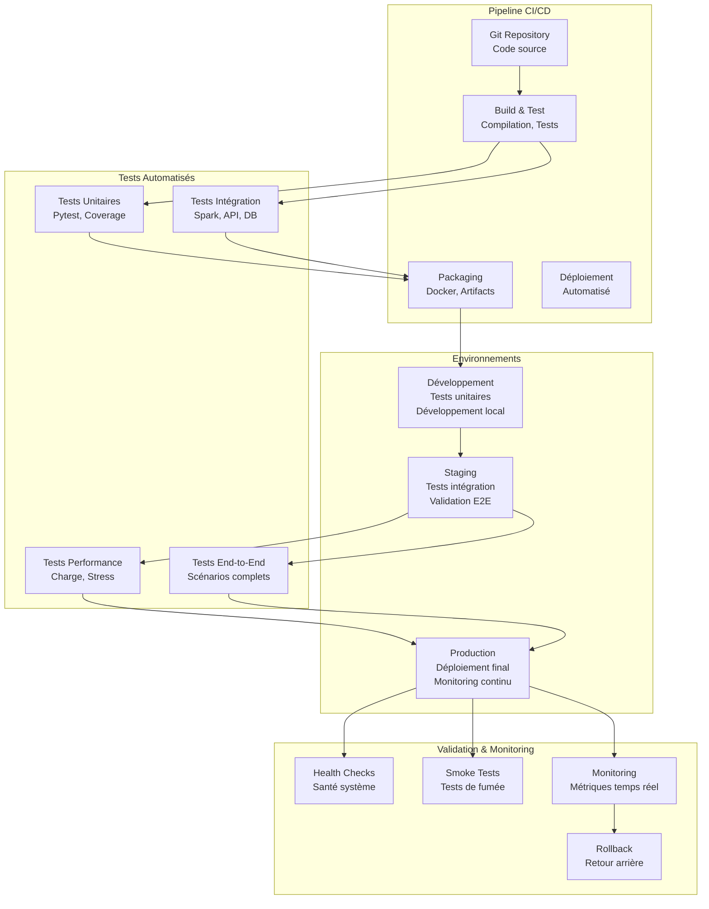

# Approche Déploiement et Tests

## 🚀 Stratégie de Déploiement



## 🏗️ Configuration des Environnements

### Environnement de Développement

```yaml
# docker-compose.dev.yml
version: '3.8'

services:
  # Hadoop Ecosystem
  namenode:
    image: apache/hadoop:3.3.4
    container_name: lakehouse-namenode
    environment:
      - CLUSTER_NAME=lakehouse-dev
    ports:
      - "9870:9870"  # Hadoop UI
      - "9000:9000"  # HDFS
    volumes:
      - namenode_data:/hadoop/dfs/name
    networks:
      - lakehouse-network

  datanode:
    image: apache/hadoop:3.3.4
    container_name: lakehouse-datanode
    environment:
      - SERVICE_PRECONDITION=namenode:9870
    volumes:
      - datanode_data:/hadoop/dfs/data
    networks:
      - lakehouse-network

  # Hive Metastore
  hive-metastore:
    image: apache/hive:3.1.3
    container_name: lakehouse-hive-metastore
    environment:
      - SERVICE_PRECONDITION=namenode:9870
    ports:
      - "9083:9083"
    networks:
      - lakehouse-network

  # MySQL pour couche Gold
  mysql:
    image: mysql:8.0
    container_name: lakehouse-mysql
    environment:
      MYSQL_ROOT_PASSWORD: root
      MYSQL_DATABASE: accidents_lakehouse
      MYSQL_USER: tatane
      MYSQL_PASSWORD: tatane
    ports:
      - "3306:3306"
    volumes:
      - mysql_data:/var/lib/mysql
      - ./scripts/database:/docker-entrypoint-initdb.d
    networks:
      - lakehouse-network

  # Redis pour cache API
  redis:
    image: redis:7-alpine
    container_name: lakehouse-redis
    ports:
      - "6379:6379"
    networks:
      - lakehouse-network

  # Application Spark (pour tests)
  spark-master:
    image: bitnami/spark:3.4
    container_name: lakehouse-spark-master
    environment:
      - SPARK_MODE=master
      - SPARK_RPC_AUTHENTICATION_ENABLED=no
      - SPARK_RPC_ENCRYPTION_ENABLED=no
      - SPARK_LOCAL_STORAGE_ENCRYPTION_ENABLED=no
      - SPARK_SSL_ENABLED=no
    ports:
      - "8080:8080"  # Spark UI
      - "7077:7077"  # Spark Master
    networks:
      - lakehouse-network

  spark-worker:
    image: bitnami/spark:3.4
    container_name: lakehouse-spark-worker
    environment:
      - SPARK_MODE=worker
      - SPARK_MASTER_URL=spark://spark-master:7077
      - SPARK_WORKER_MEMORY=2G
      - SPARK_WORKER_CORES=2
    depends_on:
      - spark-master
    networks:
      - lakehouse-network

volumes:
  namenode_data:
  datanode_data:
  mysql_data:

networks:
  lakehouse-network:
    driver: bridge
```

### Scripts de Déploiement

```bash
#!/bin/bash
# scripts/deployment/deploy_applications.sh

set -e

# Configuration
ENVIRONMENT=${1:-development}
VERSION=${2:-latest}
SPARK_MASTER=${3:-yarn}

echo "🚀 Déploiement Lakehouse Accidents US - Environnement: $ENVIRONMENT"

# Fonction de logging
log() {
    echo "[$(date +'%Y-%m-%d %H:%M:%S')] $1"
}

# Fonction de vérification des prérequis
check_prerequisites() {
    log "Vérification des prérequis..."
    
    # Vérifier Hadoop/HDFS
    if ! hdfs dfsadmin -report > /dev/null 2>&1; then
        log "❌ HDFS non accessible"
        exit 1
    fi
    
    # Vérifier Hive
    if ! hive --version > /dev/null 2>&1; then
        log "❌ Hive non accessible"
        exit 1
    fi
    
    # Vérifier MySQL
    if ! mysql -h localhost -u tatane -ptatane -e "SELECT 1;" > /dev/null 2>&1; then
        log "❌ MySQL non accessible"
        exit 1
    fi
    
    log "✅ Prérequis validés"
}

# Fonction de création des répertoires HDFS
setup_hdfs_directories() {
    log "Création des répertoires HDFS..."
    
    hdfs dfs -mkdir -p /lakehouse/accidents/bronze
    hdfs dfs -mkdir -p /lakehouse/accidents/silver
    hdfs dfs -mkdir -p /lakehouse/accidents/gold
    hdfs dfs -mkdir -p /lakehouse/accidents/logs
    hdfs dfs -mkdir -p /lakehouse/accidents/checkpoints
    
    # Permissions
    hdfs dfs -chmod -R 755 /lakehouse/accidents
    
    log "✅ Répertoires HDFS créés"
}

# Fonction de création des tables Hive
setup_hive_tables() {
    log "Création des tables Hive..."
    
    hive -f scripts/database/create_hive_tables.hql
    
    log "✅ Tables Hive créées"
}

# Fonction de création des tables MySQL
setup_mysql_tables() {
    log "Création des tables MySQL..."
    
    mysql -h localhost -u tatane -ptatane accidents_lakehouse < scripts/database/create_mysql_tables.sql
    mysql -h localhost -u tatane -ptatane accidents_lakehouse < scripts/database/setup_indexes.sql
    
    log "✅ Tables MySQL créées"
}

# Fonction de déploiement des applications Spark
deploy_spark_applications() {
    log "Déploiement des applications Spark..."
    
    # Configuration commune
    SPARK_CONF="--conf spark.master=$SPARK_MASTER \
                --conf spark.app.name=lakehouse-accidents-$ENVIRONMENT \
                --conf spark.driver.memory=1g \
                --conf spark.executor.memory=2g \
                --conf spark.executor.cores=2 \
                --conf spark.dynamicAllocation.enabled=true \
                --conf spark.dynamicAllocation.maxExecutors=4"
    
    # Déployer les JARs des applications
    APPS=("feeder" "preprocessor" "datamart" "ml_training")
    
    for app in "${APPS[@]}"; do
        log "Déploiement de l'application $app..."
        
        # Copier les fichiers Python
        hdfs dfs -put -f src/applications/$app /lakehouse/accidents/apps/
        
        # Créer le script de lancement
        cat > /tmp/launch_$app.sh << EOF
#!/bin/bash
spark-submit $SPARK_CONF \\
    --py-files /lakehouse/accidents/apps/common.zip \\
    /lakehouse/accidents/apps/$app/${app}_app.py \\
    --environment $ENVIRONMENT \\
    --version $VERSION
EOF
        
        chmod +x /tmp/launch_$app.sh
        sudo mv /tmp/launch_$app.sh /usr/local/bin/lakehouse-$app
        
        log "✅ Application $app déployée"
    done
}

# Fonction de déploiement de l'API
deploy_api() {
    log "Déploiement de l'API FastAPI..."
    
    # Créer le service systemd
    cat > /tmp/lakehouse-api.service << EOF
[Unit]
Description=Lakehouse Accidents US API
After=network.target

[Service]
Type=simple
User=lakehouse
WorkingDirectory=/opt/lakehouse-accidents-us
Environment=ENVIRONMENT=$ENVIRONMENT
ExecStart=/opt/lakehouse-accidents-us/venv/bin/uvicorn src.api.main:app --host 0.0.0.0 --port 8000
Restart=always
RestartSec=10

[Install]
WantedBy=multi-user.target
EOF
    
    sudo mv /tmp/lakehouse-api.service /etc/systemd/system/
    sudo systemctl daemon-reload
    sudo systemctl enable lakehouse-api
    sudo systemctl start lakehouse-api
    
    log "✅ API déployée et démarrée"
}

# Fonction de tests de fumée
run_smoke_tests() {
    log "Exécution des tests de fumée..."
    
    # Test HDFS
    if hdfs dfs -test -d /lakehouse/accidents; then
        log "✅ HDFS accessible"
    else
        log "❌ HDFS non accessible"
        exit 1
    fi
    
    # Test Hive
    if hive -e "SHOW DATABASES;" | grep -q accidents_warehouse; then
        log "✅ Hive accessible"
    else
        log "❌ Hive non accessible"
        exit 1
    fi
    
    # Test MySQL
    if mysql -h localhost -u tatane -ptatane -e "USE accidents_lakehouse; SHOW TABLES;" > /dev/null 2>&1; then
        log "✅ MySQL accessible"
    else
        log "❌ MySQL non accessible"
        exit 1
    fi
    
    # Test API
    if curl -f http://localhost:8000/health > /dev/null 2>&1; then
        log "✅ API accessible"
    else
        log "❌ API non accessible"
        exit 1
    fi
    
    log "✅ Tous les tests de fumée passés"
}

# Fonction principale
main() {
    log "Début du déploiement - Version: $VERSION, Environnement: $ENVIRONMENT"
    
    check_prerequisites
    setup_hdfs_directories
    setup_hive_tables
    setup_mysql_tables
    deploy_spark_applications
    deploy_api
    run_smoke_tests
    
    log "🎉 Déploiement terminé avec succès!"
    log "📊 Interfaces disponibles:"
    log "   - Hadoop UI: http://localhost:9870"
    log "   - Spark UI: http://localhost:8080"
    log "   - API Documentation: http://localhost:8000/docs"
    log "   - API Health: http://localhost:8000/health"
}

# Exécution
main "$@"
```

## 🧪 Stratégie de Tests

### Tests Unitaires

```python
# tests/unit/common/test_data_validator.py
import pytest
from pyspark.sql import SparkSession
from pyspark.sql.types import StructType, StructField, StringType, IntegerType
from src.common.data_validator import DataValidator
from src.common.exceptions import ValidationError

class TestDataValidator:
    """Tests unitaires pour DataValidator"""
    
    @pytest.fixture(scope="class")
    def spark_session(self):
        """Fixture Spark pour les tests"""
        return SparkSession.builder \
            .appName("test_data_validator") \
            .master("local[2]") \
            .config("spark.sql.adaptive.enabled", "false") \
            .getOrCreate()
    
    @pytest.fixture
    def sample_schema(self):
        """Schéma de test pour validation"""
        return StructType([
            StructField("ID", StringType(), False),
            StructField("Severity", IntegerType(), True),
            StructField("State", StringType(), True)
        ])
    
    @pytest.fixture
    def valid_data(self, spark_session):
        """Données valides pour les tests"""
        return spark_session.createDataFrame([
            ("A-1", 3, "OH"),
            ("A-2", 2, "CA"),
            ("A-3", 1, "TX")
        ], ["ID", "Severity", "State"])
    
    @pytest.fixture
    def invalid_data(self, spark_session):
        """Données invalides pour les tests"""
        return spark_session.createDataFrame([
            ("A-1", None, "OH"),  # Severity null
            ("A-2", 5, "CA"),     # Severity hors limites
            (None, 2, "TX")       # ID null (non autorisé)
        ], ["ID", "Severity", "State"])
    
    def test_validate_schema_success(self, valid_data, sample_schema):
        """Test validation schéma réussie"""
        validator = DataValidator()
        
        result = validator.validate_schema(valid_data, sample_schema)
        
        assert result is True
    
    def test_validate_schema_failure(self, spark_session, sample_schema):
        """Test validation schéma échouée"""
        # DataFrame avec colonnes manquantes
        invalid_df = spark_session.createDataFrame([
            ("A-1", 3),  # Colonne State manquante
        ], ["ID", "Severity"])
        
        validator = DataValidator()
        
        with pytest.raises(ValidationError):
            validator.validate_schema(invalid_df, sample_schema)
    
    def test_check_data_quality_success(self, valid_data):
        """Test vérification qualité réussie"""
        validator = DataValidator()
        
        rules = {
            "null_check": {"columns": ["ID"], "max_null_percent": 0},
            "range_check": {"column": "Severity", "min_value": 1, "max_value": 4}
        }
        
        result = validator.check_data_quality(valid_data, rules)
        
        assert result["passed"] is True
        assert result["score"] >= 0.95
    
    def test_check_data_quality_failure(self, invalid_data):
        """Test vérification qualité échouée"""
        validator = DataValidator()
        
        rules = {
            "null_check": {"columns": ["ID"], "max_null_percent": 0},
            "range_check": {"column": "Severity", "min_value": 1, "max_value": 4}
        }
        
        result = validator.check_data_quality(invalid_data, rules)
        
        assert result["passed"] is False
        assert result["score"] < 0.95
        assert len(result["violations"]) > 0
    
    def test_generate_quality_report(self, valid_data):
        """Test génération rapport qualité"""
        validator = DataValidator()
        
        report = validator.generate_quality_report(valid_data)
        
        assert "total_records" in report
        assert "column_stats" in report
        assert "data_types" in report
        assert report["total_records"] == 3

# tests/unit/applications/test_feeder_app.py
import pytest
from unittest.mock import Mock, patch, MagicMock
from src.applications.feeder.feeder_app import FeederApp
from src.common.exceptions import IngestionError

class TestFeederApp:
    """Tests unitaires pour FeederApp"""
    
    @pytest.fixture
    def mock_config(self):
        """Configuration mockée"""
        config = Mock()
        config.get.return_value = {
            'source_path': '/test/data.csv',
            'output_path': '/test/output',
            'partition_columns': ['date', 'state']
        }
        return config
    
    @pytest.fixture
    def mock_spark_session(self):
        """Session Spark mockée"""
        spark = Mock()
        spark.read.csv.return_value = Mock()
        return spark
    
    @pytest.fixture
    def feeder_app(self, mock_config, mock_spark_session):
        """Instance FeederApp pour tests"""
        with patch('src.applications.feeder.feeder_app.SparkSession') as mock_spark_class:
            mock_spark_class.builder.appName.return_value.master.return_value.getOrCreate.return_value = mock_spark_session
            
            app = FeederApp("test_feeder")
            app.config = mock_config
            app.spark_session = mock_spark_session
            return app
    
    def test_ingest_csv_batch_success(self, feeder_app, mock_spark_session):
        """Test ingestion CSV batch réussie"""
        # Mock DataFrame
        mock_df = Mock()
        mock_df.count.return_value = 1000
        mock_spark_session.read.csv.return_value = mock_df
        
        # Mock validation
        with patch.object(feeder_app, '_validate_data') as mock_validate:
            mock_validate.return_value = True
            
            # Mock écriture
            with patch.object(feeder_app, '_write_to_hdfs') as mock_write:
                mock_write.return_value = True
                
                result = feeder_app.ingest_csv_batch('/test/input.csv')
                
                assert result['success'] is True
                assert result['records_processed'] == 1000
                mock_validate.assert_called_once()
                mock_write.assert_called_once()
    
    def test_ingest_csv_batch_validation_failure(self, feeder_app, mock_spark_session):
        """Test échec validation lors de l'ingestion"""
        mock_df = Mock()
        mock_spark_session.read.csv.return_value = mock_df
        
        with patch.object(feeder_app, '_validate_data') as mock_validate:
            mock_validate.side_effect = IngestionError("Validation failed")
            
            with pytest.raises(IngestionError):
                feeder_app.ingest_csv_batch('/test/input.csv')
    
    def test_partition_by_date_state(self, feeder_app):
        """Test partitioning par date et état"""
        mock_df = Mock()
        
        with patch('pyspark.sql.functions.year') as mock_year, \
             patch('pyspark.sql.functions.month') as mock_month, \
             patch('pyspark.sql.functions.col') as mock_col:
            
            result = feeder_app.partition_by_date_state(mock_df)
            
            # Vérifier que les fonctions de partitioning sont appelées
            mock_year.assert_called()
            mock_month.assert_called()
            mock_col.assert_called()
```

### Tests d'Intégration

```python
# tests/integration/test_end_to_end_pipeline.py
import pytest
import time
from pathlib import Path
from pyspark.sql import SparkSession
from src.applications.feeder.feeder_app import FeederApp
from src.applications.preprocessor.preprocessor_app import PreprocessorApp
from src.applications.datamart.datamart_app import DatamartApp

class TestEndToEndPipeline:
    """Tests d'intégration du pipeline complet"""
    
    @pytest.fixture(scope="class")
    def spark_session(self):
        """Session Spark pour tests d'intégration"""
        return SparkSession.builder \
            .appName("test_e2e_pipeline") \
            .master("local[4]") \
            .config("spark.sql.adaptive.enabled", "true") \
            .config("spark.sql.adaptive.coalescePartitions.enabled", "true") \
            .getOrCreate()
    
    @pytest.fixture(scope="class")
    def test_data_path(self, tmp_path_factory):
        """Chemin vers les données de test"""
        test_dir = tmp_path_factory.mktemp("test_data")
        
        # Créer un fichier CSV de test
        test_csv = test_dir / "test_accidents.csv"
        test_csv.write_text("""ID,Source,Severity,Start_Time,Start_Lat,Start_Lng,State,County
A-1,Source1,3,2023-01-01 10:00:00,39.8651,-84.0587,OH,Montgomery
A-2,Source1,2,2023-01-01 11:00:00,39.9281,-82.8312,OH,Franklin
A-3,Source1,1,2023-01-01 12:00:00,39.0631,-84.0326,OH,Clermont
""")
        
        return str(test_csv)
    
    @pytest.fixture(scope="class")
    def output_paths(self, tmp_path_factory):
        """Chemins de sortie pour les tests"""
        base_dir = tmp_path_factory.mktemp("output")
        return {
            "bronze": str(base_dir / "bronze"),
            "silver": str(base_dir / "silver"),
            "gold": str(base_dir / "gold")
        }
    
    def test_complete_pipeline_execution(self, spark_session, test_data_path, output_paths):
        """Test d'exécution complète du pipeline"""
        
        # Étape 1: Feeder - Ingestion
        feeder = FeederApp("test_feeder")
        feeder.spark_session = spark_session
        
        feeder_result = feeder.ingest_csv_batch(
            input_path=test_data_path,
            output_path=output_paths["bronze"]
        )
        
        assert feeder_result["success"] is True
        assert feeder_result["records_processed"] == 3
        
        # Vérifier que les fichiers sont créés
        bronze_path = Path(output_paths["bronze"])
        assert bronze_path.exists()
        
        # Étape 2: Preprocessor - Transformation
        preprocessor = PreprocessorApp("test_preprocessor")
        preprocessor.spark_session = spark_session
        
        preprocessor_result = preprocessor.process_data(
            input_path=output_paths["bronze"],
            output_path=output_paths["silver"]
        )
        
        assert preprocessor_result["success"] is True
        
        # Vérifier les tables Silver
        silver_path = Path(output_paths["silver"])
        assert silver_path.exists()
        
        # Étape 3: Datamart - Agrégation
        datamart = DatamartApp("test_datamart")
        datamart.spark_session = spark_session
        
        datamart_result = datamart.generate_datamarts(
            input_path=output_paths["silver"],
            output_path=output_paths["gold"]
        )
        
        assert datamart_result["success"] is True
        
        # Vérifier les données Gold
        gold_path = Path(output_paths["gold"])
        assert gold_path.exists()
    
    def test_pipeline_data_quality(self, spark_session, output_paths):
        """Test de la qualité des données à travers le pipeline"""
        
        # Lire les données de chaque couche
        bronze_df = spark_session.read.parquet(output_paths["bronze"])
        silver_df = spark_session.read.parquet(output_paths["silver"] + "/accidents_clean")
        
        # Vérifications Bronze
        assert bronze_df.count() == 3
        assert len(bronze_df.columns) >= 8  # Colonnes originales
        
        # Vérifications Silver
        assert silver_df.count() == 3  # Pas de perte de données
        assert "cleaned_severity" in silver_df.columns  # Colonne enrichie
        
        # Vérifier l'absence de valeurs nulles critiques
        null_ids = silver_df.filter(silver_df.ID.isNull()).count()
        assert null_ids == 0
    
    def test_pipeline_performance(self, spark_session, test_data_path, output_paths):
        """Test de performance du pipeline"""
        
        start_time = time.time()
        
        # Exécuter le pipeline complet
        feeder = FeederApp("perf_test_feeder")
        feeder.spark_session = spark_session
        
        feeder.ingest_csv_batch(test_data_path, output_paths["bronze"] + "_perf")
        
        end_time = time.time()
        execution_time = end_time - start_time
        
        # Le pipeline doit s'exécuter en moins de 30 secondes pour ce petit dataset
        assert execution_time < 30
        
        # Calculer le débit
        records_per_second = 3 / execution_time
        assert records_per_second > 0.1  # Au moins 0.1 record/sec
```

### Tests de Performance

```python
# tests/performance/test_spark_performance.py
import pytest
import time
from pyspark.sql import SparkSession
from pyspark.sql.functions import col, count, avg
import psutil
import os

class TestSparkPerformance:
    """Tests de performance pour les applications Spark"""
    
    @pytest.fixture(scope="class")
    def spark_session_performance(self):
        """Session Spark optimisée pour tests de performance"""
        return SparkSession.builder \
            .appName("performance_test") \
            .master("local[*]") \
            .config("spark.sql.adaptive.enabled", "true") \
            .config("spark.sql.adaptive.coalescePartitions.enabled", "true") \
            .config("spark.executor.memory", "2g") \
            .config("spark.driver.memory", "1g") \
            .getOrCreate()
    
    def test_large_dataset_processing(self, spark_session_performance):
        """Test de traitement d'un large dataset"""
        
        # Générer un dataset de test plus large
        large_df = spark_session_performance.range(0, 1000000).toDF("id")
        large_df = large_df.withColumn("severity", (col("id") % 4) + 1)
        large_df = large_df.withColumn("state", 
            when(col("id") % 50 == 0, "OH")
            .when(col("id") % 50 == 1, "CA")
            .otherwise("TX")
        )
        
        start_time = time.time()
        
        # Opérations typiques du pipeline
        result = large_df.groupBy("state", "severity") \
                        .agg(count("*").alias("accident_count"),
                             avg("severity").alias("avg_severity")) \
                        .collect()
        
        end_time = time.time()
        processing_time = end_time - start_time
        
        # Assertions de performance
        assert processing_time < 60  # Moins de 60 secondes
        assert len(result) > 0
        
        # Calculer le débit
        records_per_second = 1000000 / processing_time
        assert records_per_second > 10000  # Au moins 10K records/sec
    
    def test_memory_usage(self, spark_session_performance):
        """Test d'utilisation mémoire"""
        
        process = psutil.Process(os.getpid())
        initial_memory = process.memory_info().rss / 1024 / 1024  # MB
        
        # Créer et traiter un DataFrame
        df = spark_session_performance.range(0, 500000).toDF("id")
        df = df.withColumn("data", col("id") * 2)
        
        # Cache le DataFrame
        df.cache()
        df.count()  # Déclencher le cache
        
        current_memory = process.memory_info().rss / 1024 / 1024  # MB
        memory_increase = current_memory - initial_memory
        
        # L'augmentation mémoire ne doit pas dépasser 1GB
        assert memory_increase < 1024
        
        # Nettoyer le cache
        df.unpersist()
    
    def test_partition_optimization(self, spark_session_performance):
        """Test d'optimisation des partitions"""
        
        # Créer un DataFrame avec beaucoup de petites partitions
        df = spark_session_performance.range(0, 100000, numPartitions=1000)
        
        start_time = time.time()
        
        # Opération sans optimisation
        result1 = df.count()
        
        unoptimized_time = time.time() - start_time
        
        # Optimiser les partitions
        optimized_df = df.coalesce(10)
        
        start_time = time.time()
        
        # Même opération avec optimisation
        result2 = optimized_df.count()
        
        optimized_time = time.time() - start_time
        
        # L'optimisation doit améliorer les performances
        assert result1 == result2  # Même résultat
        assert optimized_time < unoptimized_time  # Meilleure performance
```

### Tests API

```python
# tests/integration/test_api_endpoints.py
import pytest
from fastapi.testclient import TestClient
from src.api.main import app
from src.api.dependencies.database import get_db_session
from unittest.mock import Mock

class TestAPIEndpoints:
    """Tests d'intégration pour les endpoints API"""
    
    @pytest.fixture
    def mock_db_session(self):
        """Session de base de données mockée"""
        return Mock()
    
    @pytest.fixture
    def client(self, mock_db_session):
        """Client de test FastAPI"""
        app.dependency_overrides[get_db_session] = lambda: mock_db_session
        return TestClient(app)
    
    def test_root_endpoint(self, client):
        """Test endpoint racine"""
        response = client.get("/")
        
        assert response.status_code == 200
        data = response.json()
        assert "message" in data