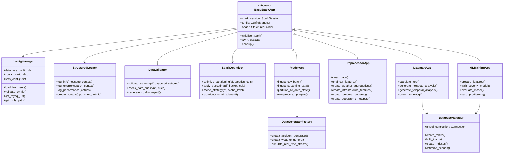

# Design Patterns et Hiérarchie des Classes

## 🏛️ Hiérarchie des Classes et Design Patterns



## 🎨 Design Patterns Utilisés

### 1. Template Method Pattern
**Classe** : [`BaseSparkApp`](src/common/base_spark_app.py)

```python
class BaseSparkApp(ABC):
    def __init__(self, app_name: str):
        self.app_name = app_name
        self.config = ConfigManager()
        self.logger = StructuredLogger(app_name)
        self.spark_session = None
    
    def execute(self):
        try:
            self.initialize_spark()
            self.run()  # Méthode abstraite implémentée par les sous-classes
        except Exception as e:
            self.logger.log_error(e, {"app": self.app_name})
            raise
        finally:
            self.cleanup()
    
    @abstractmethod
    def run(self):
        pass
    
    def initialize_spark(self):
        # Configuration commune Spark
        pass
    
    def cleanup(self):
        if self.spark_session:
            self.spark_session.stop()
```

**Avantages** :
- Code commun centralisé (initialisation Spark, logging, cleanup)
- Garantit l'exécution des étapes critiques
- Facilite la maintenance et les évolutions

### 2. Factory Pattern
**Classe** : [`DataGeneratorFactory`](src/applications/feeder/data_generator.py)

```python
class DataGeneratorFactory:
    @staticmethod
    def create_generator(generator_type: str, config: dict):
        generators = {
            'accident': AccidentDataGenerator,
            'weather': WeatherDataGenerator,
            'streaming': StreamingDataGenerator
        }
        
        if generator_type not in generators:
            raise ValueError(f"Type de générateur non supporté: {generator_type}")
        
        return generators[generator_type](config)
```

**Avantages** :
- Création d'objets centralisée et flexible
- Facilite l'ajout de nouveaux types de générateurs
- Découplage entre création et utilisation

### 3. Strategy Pattern
**Classe** : [`SparkOptimizer`](src/common/spark_optimizer.py)

```python
class SparkOptimizer:
    def __init__(self):
        self.strategies = {
            'partitioning': PartitioningStrategy(),
            'caching': CachingStrategy(),
            'broadcasting': BroadcastStrategy()
        }
    
    def optimize(self, dataframe, strategy_name: str, **kwargs):
        if strategy_name not in self.strategies:
            raise ValueError(f"Stratégie non supportée: {strategy_name}")
        
        return self.strategies[strategy_name].apply(dataframe, **kwargs)
```

**Avantages** :
- Algorithmes d'optimisation interchangeables
- Facilite les tests et la maintenance
- Extensibilité pour nouvelles optimisations

### 4. Singleton Pattern
**Classe** : [`ConfigManager`](config/config_manager.py)

```python
class ConfigManager:
    _instance = None
    _config = None
    
    def __new__(cls):
        if cls._instance is None:
            cls._instance = super().__new__(cls)
        return cls._instance
    
    def load_config(self):
        if self._config is None:
            self._config = self._load_from_env()
        return self._config
```

**Avantages** :
- Configuration unique et cohérente dans toute l'application
- Évite les rechargements multiples
- Centralisation de la gestion de configuration

## 🔧 Classes Utilitaires

### DataValidator
**Responsabilité** : Validation des schémas et qualité des données

```python
class DataValidator:
    def validate_schema(self, df: DataFrame, expected_schema: StructType) -> bool:
        # Validation du schéma des 47 colonnes
        pass
    
    def check_data_quality(self, df: DataFrame, rules: dict) -> dict:
        # Vérification des règles de qualité
        # - Valeurs nulles
        # - Cohérence géographique
        # - Plages de valeurs valides
        pass
```

### SparkOptimizer
**Responsabilité** : Optimisations Spark automatisées

```python
class SparkOptimizer:
    def optimize_partitioning(self, df: DataFrame, partition_cols: list) -> DataFrame:
        # Partitioning intelligent basé sur la cardinalité
        pass
    
    def apply_bucketing(self, df: DataFrame, bucket_cols: list, num_buckets: int) -> DataFrame:
        # Bucketing pour optimiser les jointures
        pass
    
    def cache_strategy(self, df: DataFrame, cache_level: str) -> DataFrame:
        # Stratégie de cache adaptée au volume de données
        pass
```

### DatabaseManager
**Responsabilité** : Gestion des connexions et opérations MySQL

```python
class DatabaseManager:
    def __init__(self, config: ConfigManager):
        self.config = config
        self.connection_pool = self._create_pool()
    
    def bulk_insert(self, table_name: str, data: list, batch_size: int = 1000):
        # Insertion en lot optimisée
        pass
    
    def create_indexes(self, table_name: str, index_definitions: list):
        # Création d'index pour optimiser les requêtes API
        pass
```

## 🎯 Principes de Conception Respectés

### SOLID Principles

#### Single Responsibility Principle (SRP)
- Chaque classe a une responsabilité unique et bien définie
- [`FeederApp`](src/applications/feeder/feeder_app.py) : Ingestion uniquement
- [`DataValidator`](src/common/data_validator.py) : Validation uniquement

#### Open/Closed Principle (OCP)
- Classes ouvertes à l'extension, fermées à la modification
- Nouvelles applications Spark via héritage de [`BaseSparkApp`](src/common/base_spark_app.py)
- Nouveaux générateurs via [`DataGeneratorFactory`](src/applications/feeder/data_generator.py)

#### Liskov Substitution Principle (LSP)
- Toutes les applications Spark sont substituables
- Interface commune garantie par la classe abstraite

#### Interface Segregation Principle (ISP)
- Interfaces spécialisées plutôt qu'une interface monolithique
- Séparation des responsabilités validation/optimisation/logging

#### Dependency Inversion Principle (DIP)
- Dépendance sur les abstractions, pas les implémentations concrètes
- Injection de dépendances via le constructeur

### DRY (Don't Repeat Yourself)
- Code commun centralisé dans [`BaseSparkApp`](src/common/base_spark_app.py)
- Utilitaires réutilisables dans le package [`utils`](src/utils/)
- Configuration centralisée via [`ConfigManager`](config/config_manager.py)

### KISS (Keep It Simple, Stupid)
- Architecture claire et compréhensible
- Séparation nette des responsabilités
- Pas de sur-ingénierie

## 🔄 Extensibilité

### Ajout d'une Nouvelle Application Spark
1. Hériter de [`BaseSparkApp`](src/common/base_spark_app.py)
2. Implémenter la méthode [`run()`](src/common/base_spark_app.py:15)
3. Ajouter la configuration spécifique
4. Intégrer dans le pipeline de déploiement

### Ajout d'un Nouveau Type de Données
1. Créer un générateur via [`DataGeneratorFactory`](src/applications/feeder/data_generator.py)
2. Étendre le schéma de validation
3. Adapter les transformations dans [`PreprocessorApp`](src/applications/preprocessor/preprocessor_app.py)

### Ajout d'une Nouvelle Optimisation Spark
1. Créer une nouvelle stratégie dans [`SparkOptimizer`](src/common/spark_optimizer.py)
2. Implémenter l'interface commune
3. Intégrer dans les applications concernées