# Stratégie Logging et Monitoring

## 📊 Architecture de Monitoring et Observabilité

```mermaid
graph TB
    subgraph "Sources de Logs"
        SPARK_APPS[Applications Spark<br/>Feeder, Preprocessor, Datamart, ML]
        API_LOGS[API FastAPI<br/>Requêtes et réponses]
        SYSTEM_LOGS[Logs Système<br/>HDFS, Hive, MySQL]
    end

    subgraph "Collecte et Agrégation"
        STRUCTURED_LOG[Logging Structuré<br/>Format JSON uniforme]
        LOG_COLLECTOR[Collecteur de Logs<br/>Fluentd/Filebeat]
        METRICS_COLLECTOR[Collecteur Métriques<br/>Prometheus agents]
    end

    subgraph "Stockage et Indexation"
        LOG_STORAGE[Stockage Logs<br/>Elasticsearch/Loki]
        METRICS_DB[Base Métriques<br/>Prometheus TSDB]
        TRACES_DB[Base Traces<br/>Jaeger/Zipkin]
    end

    subgraph "Visualisation et Alertes"
        DASHBOARDS[Tableaux de Bord<br/>Grafana]
        LOG_SEARCH[Recherche Logs<br/>Kibana/Grafana]
        ALERTING[Système d'Alertes<br/>AlertManager]
        NOTIFICATIONS[Notifications<br/>Email, Slack, Teams]
    end

    subgraph "Monitoring Métier"
        BUSINESS_METRICS[Métriques Métier<br/>KPIs, SLA]
        PERFORMANCE_MONITOR[Monitoring Performance<br/>Latence, Débit]
        ERROR_TRACKING[Suivi Erreurs<br/>Taux d'erreur, Stack traces]
    end

    SPARK_APPS --> STRUCTURED_LOG
    API_LOGS --> STRUCTURED_LOG
    SYSTEM_LOGS --> STRUCTURED_LOG
    
    STRUCTURED_LOG --> LOG_COLLECTOR
    SPARK_APPS --> METRICS_COLLECTOR
    API_LOGS --> METRICS_COLLECTOR
    
    LOG_COLLECTOR --> LOG_STORAGE
    METRICS_COLLECTOR --> METRICS_DB
    
    LOG_STORAGE --> LOG_SEARCH
    METRICS_DB --> DASHBOARDS
    
    DASHBOARDS --> ALERTING
    LOG_SEARCH --> ALERTING
    
    ALERTING --> NOTIFICATIONS
    
    METRICS_DB --> BUSINESS_METRICS
    METRICS_DB --> PERFORMANCE_MONITOR
    LOG_STORAGE --> ERROR_TRACKING
```



## 🔧 Configuration Logging Structuré

### Logger Principal

```python
# src/common/structured_logger.py
import json
import logging
import time
from datetime import datetime
from typing import Dict, Any, Optional
from pathlib import Path
import structlog
from pythonjsonlogger import jsonlogger

from config.config_manager import ConfigManager

class StructuredLogger:
    """Logger structuré avec format JSON pour toutes les applications"""
    
    def __init__(self, app_name: str, component: str = "main"):
        self.app_name = app_name
        self.component = component
        self.config = ConfigManager()
        self._setup_logger()
    
    def _setup_logger(self):
        """Configure le logger avec format JSON structuré"""
        
        # Configuration structlog
        structlog.configure(
            processors=[
                structlog.stdlib.filter_by_level,
                structlog.stdlib.add_logger_name,
                structlog.stdlib.add_log_level,
                structlog.stdlib.PositionalArgumentsFormatter(),
                structlog.processors.TimeStamper(fmt="iso"),
                structlog.processors.StackInfoRenderer(),
                structlog.processors.format_exc_info,
                structlog.processors.UnicodeDecoder(),
                structlog.processors.JSONRenderer()
            ],
            context_class=dict,
            logger_factory=structlog.stdlib.LoggerFactory(),
            wrapper_class=structlog.stdlib.BoundLogger,
            cache_logger_on_first_use=True,
        )
        
        # Configuration du logger standard
        self.logger = structlog.get_logger(self.app_name)
        
        # Configuration des handlers
        self._setup_handlers()
    
    def _setup_handlers(self):
        """Configure les handlers de logging"""
        
        log_config = self.config.get('logging', {})
        log_level = getattr(logging, log_config.get('level', 'INFO'))
        
        # Handler console
        console_handler = logging.StreamHandler()
        console_formatter = jsonlogger.JsonFormatter(
            '%(asctime)s %(name)s %(levelname)s %(message)s'
        )
        console_handler.setFormatter(console_formatter)
        console_handler.setLevel(log_level)
        
        # Handler fichier avec rotation
        if log_config.get('file_path'):
            from logging.handlers import RotatingFileHandler
            
            log_file = Path(log_config['file_path']) / f"{self.app_name}.log"
            log_file.parent.mkdir(parents=True, exist_ok=True)
            
            file_handler = RotatingFileHandler(
                log_file,
                maxBytes=self._parse_size(log_config.get('max_size', '100MB')),
                backupCount=int(log_config.get('backup_count', 5))
            )
            file_handler.setFormatter(console_formatter)
            file_handler.setLevel(log_level)
            
            # Ajouter les handlers au logger root
            root_logger = logging.getLogger()
            root_logger.addHandler(file_handler)
        
        root_logger = logging.getLogger()
        root_logger.addHandler(console_handler)
        root_logger.setLevel(log_level)
    
    def _parse_size(self, size_str: str) -> int:
        """Parse une taille de fichier (ex: '100MB' -> bytes)"""
        units = {'B': 1, 'KB': 1024, 'MB': 1024**2, 'GB': 1024**3}
        size_str = size_str.upper()
        
        for unit in units:
            if size_str.endswith(unit):
                return int(size_str[:-len(unit)]) * units[unit]
        
        return int(size_str)  # Assume bytes si pas d'unité
    
    def create_context(self, job_id: Optional[str] = None, **kwargs) -> Dict[str, Any]:
        """Crée un contexte de logging enrichi"""
        context = {
            "app_name": self.app_name,
            "component": self.component,
            "timestamp": datetime.utcnow().isoformat(),
            "hostname": self.config.get('hostname', 'unknown'),
            "environment": self.config.get('environment', 'development'),
        }
        
        if job_id:
            context["job_id"] = job_id
        
        context.update(kwargs)
        return context
    
    def log_info(self, message: str, context: Optional[Dict[str, Any]] = None, **kwargs):
        """Log un message d'information avec contexte"""
        log_context = self.create_context(**(context or {}))
        log_context.update(kwargs)
        self.logger.info(message, **log_context)
    
    def log_error(self, message: str, exception: Optional[Exception] = None, 
                  context: Optional[Dict[str, Any]] = None, **kwargs):
        """Log une erreur avec stack trace"""
        log_context = self.create_context(**(context or {}))
        log_context.update(kwargs)
        
        if exception:
            log_context["exception_type"] = type(exception).__name__
            log_context["exception_message"] = str(exception)
            log_context["stack_trace"] = self._format_exception(exception)
        
        self.logger.error(message, **log_context)
    
    def log_warning(self, message: str, context: Optional[Dict[str, Any]] = None, **kwargs):
        """Log un avertissement"""
        log_context = self.create_context(**(context or {}))
        log_context.update(kwargs)
        self.logger.warning(message, **log_context)
    
    def log_performance(self, operation: str, duration_seconds: float, 
                       metrics: Optional[Dict[str, Any]] = None, **kwargs):
        """Log des métriques de performance"""
        log_context = self.create_context(**kwargs)
        log_context.update({
            "operation": operation,
            "duration_seconds": duration_seconds,
            "performance_metrics": metrics or {},
            "log_type": "performance"
        })
        
        self.logger.info(f"Performance: {operation}", **log_context)
    
    def log_business_event(self, event_type: str, event_data: Dict[str, Any], **kwargs):
        """Log un événement métier"""
        log_context = self.create_context(**kwargs)
        log_context.update({
            "event_type": event_type,
            "event_data": event_data,
            "log_type": "business_event"
        })
        
        self.logger.info(f"Business Event: {event_type}", **log_context)
    
    def _format_exception(self, exception: Exception) -> str:
        """Formate une exception pour le logging"""
        import traceback
        return traceback.format_exception(type(exception), exception, exception.__traceback__)

# Décorateur pour logging automatique des fonctions
def log_execution(logger: StructuredLogger, log_args: bool = False):
    """Décorateur pour logger automatiquement l'exécution des fonctions"""
    def decorator(func):
        def wrapper(*args, **kwargs):
            start_time = time.time()
            func_name = f"{func.__module__}.{func.__name__}"
            
            context = {"function": func_name}
            if log_args:
                context["arguments"] = {"args": str(args), "kwargs": str(kwargs)}
            
            logger.log_info(f"Starting {func_name}", context)
            
            try:
                result = func(*args, **kwargs)
                duration = time.time() - start_time
                
                logger.log_performance(
                    operation=func_name,
                    duration_seconds=duration,
                    metrics={"status": "success"}
                )
                
                return result
                
            except Exception as e:
                duration = time.time() - start_time
                
                logger.log_error(
                    f"Error in {func_name}",
                    exception=e,
                    context={
                        "function": func_name,
                        "duration_seconds": duration
                    }
                )
                raise
        
        return wrapper
    return decorator
```

### Configuration Logging par Application

```python
# config/logging_config.py
from typing import Dict, Any

class LoggingConfig:
    """Configuration de logging spécialisée par application"""
    
    @staticmethod
    def get_feeder_config() -> Dict[str, Any]:
        """Configuration logging pour l'application Feeder"""
        return {
            "level": "INFO",
            "format": "json",
            "handlers": ["console", "file"],
            "metrics": {
                "log_ingestion_rate": True,
                "log_file_sizes": True,
                "log_validation_errors": True
            },
            "business_events": [
                "ingestion_started",
                "ingestion_completed",
                "validation_failed",
                "partition_created"
            ]
        }
    
    @staticmethod
    def get_preprocessor_config() -> Dict[str, Any]:
        """Configuration logging pour Preprocessor"""
        return {
            "level": "INFO",
            "format": "json",
            "handlers": ["console", "file"],
            "metrics": {
                "log_transformation_time": True,
                "log_data_quality_metrics": True,
                "log_feature_engineering_stats": True
            },
            "business_events": [
                "preprocessing_started",
                "data_cleaning_completed",
                "feature_engineering_completed",
                "hive_tables_created"
            ]
        }
    
    @staticmethod
    def get_api_config() -> Dict[str, Any]:
        """Configuration logging pour l'API"""
        return {
            "level": "INFO",
            "format": "json",
            "handlers": ["console", "file"],
            "request_logging": {
                "log_all_requests": True,
                "log_request_body": False,  # Sécurité
                "log_response_time": True,
                "log_user_agent": True
            },
            "metrics": {
                "log_response_times": True,
                "log_error_rates": True,
                "log_endpoint_usage": True
            }
        }
```

## 📈 Métriques et KPIs de Monitoring

### Collecteur de Métriques Spark

```python
# src/common/spark_metrics_collector.py
import time
from typing import Dict, Any, Optional
from pyspark.sql import SparkSession
from .structured_logger import StructuredLogger

class SparkMetricsCollector:
    """Collecteur de métriques pour les applications Spark"""
    
    def __init__(self, spark_session: SparkSession, logger: StructuredLogger):
        self.spark = spark_session
        self.logger = logger
        self.start_time = time.time()
        self.job_metrics = {}
    
    def collect_job_start_metrics(self, job_name: str, input_records: Optional[int] = None):
        """Collecte les métriques au début d'un job"""
        self.job_metrics[job_name] = {
            "start_time": time.time(),
            "input_records": input_records,
            "spark_context_id": self.spark.sparkContext.applicationId
        }
        
        self.logger.log_business_event(
            "spark_job_started",
            {
                "job_name": job_name,
                "input_records": input_records,
                "application_id": self.spark.sparkContext.applicationId
            }
        )
    
    def collect_job_end_metrics(self, job_name: str, output_records: Optional[int] = None,
                               success: bool = True):
        """Collecte les métriques à la fin d'un job"""
        if job_name not in self.job_metrics:
            self.logger.log_warning(f"No start metrics found for job {job_name}")
            return
        
        start_metrics = self.job_metrics[job_name]
        end_time = time.time()
        duration = end_time - start_metrics["start_time"]
        
        # Métriques Spark détaillées
        status_tracker = self.spark.sparkContext.statusTracker()
        executor_infos = status_tracker.getExecutorInfos()
        
        metrics = {
            "job_name": job_name,
            "duration_seconds": duration,
            "input_records": start_metrics.get("input_records"),
            "output_records": output_records,
            "success": success,
            "records_per_second": (output_records / duration) if output_records and duration > 0 else 0,
            "executor_count": len(executor_infos),
            "total_memory_used": sum(e.memoryUsed for e in executor_infos),
            "total_max_memory": sum(e.maxMemory for e in executor_infos),
            "total_disk_used": sum(e.diskUsed for e in executor_infos),
            "active_jobs": len(status_tracker.getActiveJobIds()),
            "active_stages": len(status_tracker.getActiveStageIds())
        }
        
        # Calculer le taux d'utilisation mémoire
        if metrics["total_max_memory"] > 0:
            metrics["memory_utilization_percent"] = (
                metrics["total_memory_used"] / metrics["total_max_memory"]
            ) * 100
        
        self.logger.log_performance(
            operation=f"spark_job_{job_name}",
            duration_seconds=duration,
            metrics=metrics
        )
        
        # Log événement métier
        self.logger.log_business_event(
            "spark_job_completed",
            metrics
        )
        
        # Nettoyer les métriques
        del self.job_metrics[job_name]
    
    def collect_dataframe_metrics(self, df_name: str, dataframe, operation: str):
        """Collecte les métriques d'un DataFrame"""
        start_time = time.time()
        
        try:
            # Métriques de base (attention: count() déclenche une action)
            record_count = dataframe.count()
            column_count = len(dataframe.columns)
            
            # Informations sur les partitions
            partition_count = dataframe.rdd.getNumPartitions()
            
            duration = time.time() - start_time
            
            metrics = {
                "dataframe_name": df_name,
                "operation": operation,
                "record_count": record_count,
                "column_count": column_count,
                "partition_count": partition_count,
                "collection_duration_seconds": duration
            }
            
            self.logger.log_info(
                f"DataFrame metrics: {df_name}",
                context={"dataframe_metrics": metrics}
            )
            
            return metrics
            
        except Exception as e:
            self.logger.log_error(
                f"Failed to collect DataFrame metrics for {df_name}",
                exception=e,
                context={"dataframe_name": df_name, "operation": operation}
            )
            return None
    
    def collect_storage_metrics(self, storage_path: str, operation: str):
        """Collecte les métriques de stockage HDFS"""
        try:
            # Utiliser les APIs Hadoop pour obtenir les métriques de stockage
            hadoop_conf = self.spark.sparkContext._jsc.hadoopConfiguration()
            fs = self.spark.sparkContext._jvm.org.apache.hadoop.fs.FileSystem.get(hadoop_conf)
            path = self.spark.sparkContext._jvm.org.apache.hadoop.fs.Path(storage_path)
            
            if fs.exists(path):
                file_status = fs.getFileStatus(path)
                
                metrics = {
                    "storage_path": storage_path,
                    "operation": operation,
                    "file_size_bytes": file_status.getLen(),
                    "modification_time": file_status.getModificationTime(),
                    "replication_factor": file_status.getReplication(),
                    "block_size": file_status.getBlockSize()
                }
                
                self.logger.log_info(
                    f"Storage metrics: {storage_path}",
                    context={"storage_metrics": metrics}
                )
                
                return metrics
            
        except Exception as e:
            self.logger.log_error(
                f"Failed to collect storage metrics for {storage_path}",
                exception=e,
                context={"storage_path": storage_path, "operation": operation}
            )
            return None
```

### Métriques API FastAPI

```python
# src/api/middleware/metrics_middleware.py
import time
from typing import Dict, Any
from fastapi import Request, Response
from starlette.middleware.base import BaseHTTPMiddleware
from prometheus_client import Counter, Histogram, Gauge
import structlog

# Métriques Prometheus
REQUEST_COUNT = Counter(
    'api_requests_total',
    'Total API requests',
    ['method', 'endpoint', 'status_code']
)

REQUEST_DURATION = Histogram(
    'api_request_duration_seconds',
    'API request duration',
    ['method', 'endpoint']
)

ACTIVE_REQUESTS = Gauge(
    'api_active_requests',
    'Active API requests',
    ['endpoint']
)

ERROR_RATE = Counter(
    'api_errors_total',
    'Total API errors',
    ['endpoint', 'error_type']
)

class MetricsMiddleware(BaseHTTPMiddleware):
    """Middleware pour collecter les métriques API"""
    
    def __init__(self, app):
        super().__init__(app)
        self.logger = structlog.get_logger("api_metrics")
    
    async def dispatch(self, request: Request, call_next):
        # Métriques de début de requête
        start_time = time.time()
        endpoint = self._get_endpoint_name(request)
        method = request.method
        
        ACTIVE_REQUESTS.labels(endpoint=endpoint).inc()
        
        try:
            # Traiter la requête
            response = await call_next(request)
            
            # Métriques de fin de requête
            duration = time.time() - start_time
            status_code = response.status_code
            
            # Enregistrer les métriques
            REQUEST_COUNT.labels(
                method=method,
                endpoint=endpoint,
                status_code=status_code
            ).inc()
            
            REQUEST_DURATION.labels(
                method=method,
                endpoint=endpoint
            ).observe(duration)
            
            # Log structuré
            self.logger.info(
                "API Request",
                method=method,
                endpoint=endpoint,
                status_code=status_code,
                duration_seconds=duration,
                client_ip=request.client.host,
                user_agent=request.headers.get("user-agent", "unknown")
            )
            
            # Alertes sur les requêtes lentes
            if duration > 5.0:  # Plus de 5 secondes
                self.logger.warning(
                    "Slow API Request",
                    method=method,
                    endpoint=endpoint,
                    duration_seconds=duration,
                    threshold_seconds=5.0
                )
            
            return response
            
        except Exception as e:
            # Métriques d'erreur
            ERROR_RATE.labels(
                endpoint=endpoint,
                error_type=type(e).__name__
            ).inc()
            
            duration = time.time() - start_time
            
            self.logger.error(
                "API Request Error",
                method=method,
                endpoint=endpoint,
                duration_seconds=duration,
                error_type=type(e).__name__,
                error_message=str(e)
            )
            
            raise
            
        finally:
            ACTIVE_REQUESTS.labels(endpoint=endpoint).dec()
    
    def _get_endpoint_name(self, request: Request) -> str:
        """Extrait le nom de l'endpoint de la requête"""
        path = request.url.path
        
        # Normaliser les endpoints avec paramètres
        if "/accidents/" in path and path.split("/accidents/")[-1]:
            return "/accidents/{id}"
        elif "/hotspots/" in path and path.split("/hotspots/")[-1]:
            return "/hotspots/{id}"
        elif "/kpis/" in path and path.split("/kpis/")[-1]:
            return "/kpis/{metric}"
        
        return path
```

## 🚨 Système d'Alertes

### Configuration des Alertes

```python
# monitoring/alerts/alert_manager.py
from typing import Dict, Any, List, Optional
from enum import Enum
from dataclasses import dataclass
from datetime import datetime, timedelta
import asyncio

class AlertSeverity(Enum):
    INFO = "info"
    WARNING = "warning"
    CRITICAL = "critical"

class AlertStatus(Enum):
    ACTIVE = "active"
    RESOLVED = "resolved"
    ACKNOWLEDGED = "acknowledged"

@dataclass
class Alert:
    id: str
    title: str
    description: str
    severity: AlertSeverity
    status: AlertStatus
    created_at: datetime
    source: str
    metrics: Dict[str, Any]
    threshold: Optional[float] = None
    current_value: Optional[float] = None

class AlertManager:
    """Gestionnaire d'alertes pour le système lakehouse"""
    
    def __init__(self):
        self.active_alerts: Dict[str, Alert] = {}
        self.alert_rules = self._load_alert_rules()
        self.notification_service = NotificationService()
    
    def _load_alert_rules(self) -> Dict[str, Dict[str, Any]]:
        """Charge les règles d'alerte"""
        return {
            # Alertes Spark
            "spark_job_duration": {
                "threshold": 1800,  # 30 minutes
                "severity": AlertSeverity.WARNING,
                "description": "Job Spark prend trop de temps à s'exécuter"
            },
            "spark_memory_usage": {
                "threshold": 85,  # 85%
                "severity": AlertSeverity.CRITICAL,
                "description": "Utilisation mémoire Spark élevée"
            },
            "spark_job_failure": {
                "threshold": 1,  # 1 échec
                "severity": AlertSeverity.CRITICAL,
                "description": "Échec d'un job Spark"
            },
            
            # Alertes API
            "api_response_time": {
                "threshold": 5.0,  # 5 secondes
                "severity": AlertSeverity.WARNING,
                "description": "Temps de réponse API élevé"
            },
            "api_error_rate": {
                "threshold": 5.0,  # 5%
                "severity": AlertSeverity.CRITICAL,
                "description": "Taux d'erreur API élevé"
            },
            "api_availability": {
                "threshold": 99.0,  # 99%
                "severity": AlertSeverity.CRITICAL,
                "description": "Disponibilité API faible"
            },
            
            # Alertes Infrastructure
            "hdfs_disk_usage": {
                "threshold": 90,  # 90%
                "severity": AlertSeverity.WARNING,
                "description": "Espace disque HDFS faible"
            },
            "mysql_connection_pool": {
                "threshold": 80,  # 80%
                "severity": AlertSeverity.WARNING,
                "description": "Pool de connexions MySQL saturé"
            },
            
            # Alertes Métier
            "data_quality_score": {
                "threshold": 95,  # 95%
                "severity": AlertSeverity.WARNING,
                "description": "Score de qualité des données faible"
            },
            "prediction_accuracy": {
                "threshold": 85,  # 85%
                "severity": AlertSeverity.WARNING,
                "description": "Précision du modèle ML faible"
            }
        }
    
    async def check_spark_metrics(self, metrics: Dict[str, Any]):
        """Vérifie les métriques Spark et déclenche des alertes"""
        
        # Vérifier la durée des jobs
        if "duration_seconds" in metrics:
            await self._check_threshold(
                "spark_job_duration",
                metrics["duration_seconds"],
                f"Job {metrics.get('job_name', 'unknown')}",
                metrics
            )
        
        # Vérifier l'utilisation mémoire
        if "memory_utilization_percent" in metrics:
            await self._check_threshold(
                "spark_memory_usage",
                metrics["memory_utilization_percent"],
                "Utilisation mémoire Spark",
                metrics
            )
        
        # Vérifier les échecs de jobs
        if not metrics.get("success", True):
            await self._trigger_alert(
                "spark_job_failure",
                f"Échec du job {metrics.get('job_name', 'unknown')}",
                metrics
            )
    
    async def check_api_metrics(self, metrics: Dict[str, Any]):
        """Vérifie les métriques API"""
        
        # Vérifier le temps de réponse
        if "duration_seconds" in metrics:
            await self._check_threshold(
                "api_response_time",
                metrics["duration_seconds"],
                f"Endpoint {metrics.get('endpoint', 'unknown')}",
                metrics
            )
        
        # Calculer et vérifier le taux d'erreur (nécessite agrégation)
        error_rate = await self._calculate_api_error_rate(
            metrics.get("endpoint", "unknown")
        )
        if error_rate is not None:
            await self._check_threshold(
                "api_error_rate",
                error_rate,
                f"Taux d'erreur API {metrics.get('endpoint', 'unknown')}",
                {"error_rate": error_rate, **metrics}
            )
    
    async def _check_threshold(self, rule_name: str, current_value: float,
                             context: str, metrics: Dict[str, Any]):
        """Vérifie si une valeur dépasse un seuil"""
        
        if rule_name not in self.alert_rules:
            return
        
        rule = self.alert_rules[rule_name]
        threshold = rule["threshold"]
        
        # Logique de comparaison selon le type de métrique
        should_alert = False
        if rule_name in ["spark_job_duration", "api_response_time", "spark_memory_usage", 
                        "hdfs_disk_usage", "mysql_connection_pool", "api_error_rate"]:
            should_alert = current_value > threshold
        elif rule_name in ["data_quality_score", "prediction_accuracy", "api_availability"]:
            should_alert = current_value < threshold
        
        if should_alert:
            await self._trigger_alert(rule_name, context, metrics, threshold, current_value)
        else:
            await self._resolve_alert(rule_name)
    
    async def _trigger_alert(self, rule_name: str, context: str, 
                           metrics: Dict[str, Any], threshold: Optional[float] = None,
                           current_value: Optional[float] = None):
        """Déclenche une alerte"""
        
        alert_id = f"{rule_name}_{context.replace(' ', '_')}"
        
        if alert_id in self.active_alerts:
            return  # Alerte déjà active
        
        rule = self.alert_rules[rule_name]
        
        alert = Alert(
            id=alert_id,
            title=f"Alerte {rule_name}: {context}",
            description=rule["description"],
            severity=rule["severity"],
            status=AlertStatus.ACTIVE,
            created_at=datetime.now(),
            source="lakehouse_monitoring",
            metrics=metrics,
            threshold=threshold,
            current_value=current_value
        )
        
        self.active_alerts[alert_id] = alert
        
        # Envoyer la notification
        await self.notification_service.send_alert(alert)
        
        # Log l'alerte
        logger = structlog.get_logger("alert_manager")
        logger.warning(
            "Alert triggered",
            alert_id=alert_id,
            rule_name=rule_name,
            severity=alert.severity.value,
            context=context,
            threshold=threshold,
            current_value=current_value,
            metrics=metrics
        )
    
    async def _resolve_alert(self, rule_name: str):
        """Résout une alerte si elle existe"""
        
        # Trouver les alertes actives pour cette règle
        alerts_to_resolve = [
            alert_id for alert_id, alert in self.active_alerts.items()