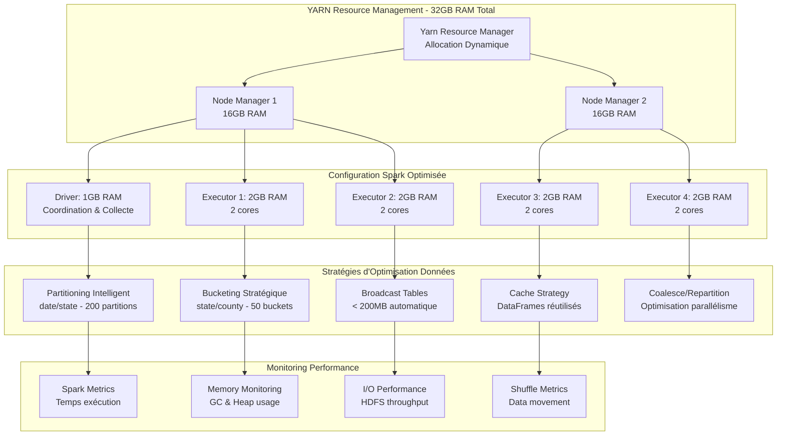

# Stratégie d'Optimisation Spark et Configuration Yarn

## 🚀 Architecture d'Optimisation Spark



## ⚙️ Configuration Spark Optimisée

### Configuration de Base pour 32GB RAM / Dataset 3GB

```python
# config/spark_config.py - Configuration optimisée
SPARK_BASE_CONFIG = {
    # Configuration cluster
    "spark.master": "yarn",
    "spark.submit.deployMode": "client",
    "spark.app.name": "lakehouse-accidents-us",
    
    # Configuration mémoire - Total utilisé: ~9GB sur 32GB disponibles
    "spark.driver.memory": "1g",
    "spark.driver.maxResultSize": "512m",
    "spark.driver.memoryFraction": "0.8",
    "spark.executor.memory": "2g",
    "spark.executor.memoryFraction": "0.8",
    "spark.executor.cores": "2",
    
    # Allocation dynamique - Max 4 executors * 2GB = 8GB + 1GB driver = 9GB total
    "spark.dynamicAllocation.enabled": "true",
    "spark.dynamicAllocation.minExecutors": "1",
    "spark.dynamicAllocation.maxExecutors": "4",
    "spark.dynamicAllocation.initialExecutors": "2",
    "spark.dynamicAllocation.executorIdleTimeout": "60s",
    "spark.dynamicAllocation.cachedExecutorIdleTimeout": "300s",
    
    # Configuration SQL adaptative - Optimisé pour 3GB de données
    "spark.sql.adaptive.enabled": "true",
    "spark.sql.adaptive.coalescePartitions.enabled": "true",
    "spark.sql.adaptive.coalescePartitions.minPartitionNum": "1",
    "spark.sql.adaptive.coalescePartitions.initialPartitionNum": "200",
    "spark.sql.adaptive.advisoryPartitionSizeInBytes": "67108864",  # 64MB
    "spark.sql.adaptive.skewJoin.enabled": "true",
    "spark.sql.adaptive.skewJoin.skewedPartitionFactor": "5",
    "spark.sql.adaptive.skewJoin.skewedPartitionThresholdInBytes": "256MB",
    "spark.sql.adaptive.localShuffleReader.enabled": "true",
    
    # Configuration shuffle - Optimisé pour les jointures fréquentes
    "spark.sql.shuffle.partitions": "200",  # Adapté au volume de données
    "spark.sql.adaptive.shuffle.targetPostShuffleInputSize": "67108864",  # 64MB
    "spark.shuffle.compress": "true",
    "spark.shuffle.spill.compress": "true",
    "spark.shuffle.file.buffer": "64k",
    
    # Sérialisation - Performance optimisée
    "spark.serializer": "org.apache.spark.serializer.KryoSerializer",
    "spark.kryo.unsafe": "true",
    "spark.kryo.referenceTracking": "false",
    "spark.kryoserializer.buffer.max": "1024m",
    
    # Configuration I/O - Optimisé pour HDFS
    "spark.sql.files.maxPartitionBytes": "134217728",  # 128MB
    "spark.sql.files.openCostInBytes": "4194304",  # 4MB
    "spark.hadoop.mapreduce.input.fileinputformat.split.minsize": "67108864",  # 64MB
    
    # Configuration cache et stockage
    "spark.storage.level": "MEMORY_AND_DISK_SER",
    "spark.storage.memoryFraction": "0.6",
    "spark.storage.unrollFraction": "0.2",
    
    # Configuration broadcast - Tables < 200MB
    "spark.sql.autoBroadcastJoinThreshold": "209715200",  # 200MB
    "spark.broadcast.compress": "true",
    
    # Configuration Arrow pour pandas UDF (si utilisé)
    "spark.sql.execution.arrow.pyspark.enabled": "true",
    "spark.sql.execution.arrow.maxRecordsPerBatch": "10000",
    
    # Configuration garbage collection
    "spark.executor.extraJavaOptions": "-XX:+UseG1GC -XX:+UnlockDiagnosticVMOptions -XX:+G1PrintRegionRememberSetInfo -XX:+PrintGC -XX:+PrintGCDetails -XX:+PrintGCTimeStamps -XX:+PrintGCApplicationStoppedTime",
    "spark.driver.extraJavaOptions": "-XX:+UseG1GC",
    
    # Configuration réseau
    "spark.network.timeout": "300s",
    "spark.executor.heartbeatInterval": "20s",
    "spark.sql.broadcastTimeout": "300",
}
```

### Configurations Spécialisées par Application

```python
class SparkOptimizedConfig:
    """Configurations Spark optimisées par application"""
    
    @staticmethod
    def get_feeder_config() -> Dict[str, str]:
        """Configuration pour l'application Feeder - Ingestion intensive"""
        config = SPARK_BASE_CONFIG.copy()
        config.update({
            "spark.app.name": "lakehouse-accidents-feeder",
            
            # Optimisations pour ingestion CSV
            "spark.sql.adaptive.coalescePartitions.enabled": "true",
            "spark.sql.adaptive.coalescePartitions.minPartitionNum": "4",
            "spark.sql.files.maxPartitionBytes": "67108864",  # 64MB pour CSV
            
            # Cache désactivé pour ingestion one-shot
            "spark.sql.cache.serializer": "org.apache.spark.sql.execution.columnar.InMemoryTableScanExec",
            
            # Optimisations écriture Parquet
            "spark.sql.parquet.compression.codec": "snappy",
            "spark.sql.parquet.block.size": "134217728",  # 128MB
            "spark.sql.parquet.page.size": "1048576",  # 1MB
            "spark.sql.parquet.dictionary.enabled": "true",
            
            # Partitioning optimisé
            "spark.sql.sources.partitionOverwriteMode": "dynamic",
        })
        return config
    
    @staticmethod
    def get_preprocessor_config() -> Dict[str, str]:
        """Configuration pour Preprocessor - Transformations complexes"""
        config = SPARK_BASE_CONFIG.copy()
        config.update({
            "spark.app.name": "lakehouse-accidents-preprocessor",
            
            # Cache activé pour réutilisation des DataFrames
            "spark.sql.cache.serializer": "org.apache.spark.sql.execution.columnar.InMemoryTableScanExec",
            "spark.storage.level": "MEMORY_AND_DISK_SER",
            
            # Optimisations pour jointures multiples
            "spark.sql.adaptive.skewJoin.enabled": "true",
            "spark.sql.adaptive.localShuffleReader.enabled": "true",
            "spark.sql.autoBroadcastJoinThreshold": "104857600",  # 100MB
            
            # Optimisations pour feature engineering
            "spark.sql.adaptive.coalescePartitions.enabled": "true",
            "spark.sql.adaptive.advisoryPartitionSizeInBytes": "33554432",  # 32MB
            
            # Configuration pour UDF Python si nécessaire
            "spark.python.worker.memory": "512m",
            "spark.python.worker.reuse": "true",
        })
        return config
    
    @staticmethod
    def get_datamart_config() -> Dict[str, str]:
        """Configuration pour Datamart - Agrégations et export"""
        config = SPARK_BASE_CONFIG.copy()
        config.update({
            "spark.app.name": "lakehouse-accidents-datamart",
            
            # Optimisations pour agrégations
            "spark.sql.adaptive.coalescePartitions.enabled": "true",
            "spark.sql.adaptive.coalescePartitions.minPartitionNum": "1",
            "spark.sql.shuffle.partitions": "100",  # Moins de partitions pour agrégations
            
            # Optimisations pour export MySQL
            "spark.sql.execution.arrow.maxRecordsPerBatch": "5000",
            "spark.sql.adaptive.shuffle.targetPostShuffleInputSize": "134217728",  # 128MB
            
            # Configuration JDBC optimisée
            "spark.sql.adaptive.coalescePartitions.parallelismFirst": "false",
        })
        return config
    
    @staticmethod
    def get_ml_training_config() -> Dict[str, str]:
        """Configuration pour ML Training - Calculs intensifs"""
        config = SPARK_BASE_CONFIG.copy()
        config.update({
            "spark.app.name": "lakehouse-accidents-ml-training",
            
            # Plus de mémoire pour ML
            "spark.executor.memory": "3g",  # Augmenté pour ML
            "spark.driver.memory": "2g",    # Augmenté pour collecte des résultats
            "spark.dynamicAllocation.maxExecutors": "3",  # Ajusté pour la mémoire
            
            # Optimisations pour calculs ML
            "spark.sql.execution.arrow.pyspark.enabled": "true",
            "spark.sql.execution.arrow.maxRecordsPerBatch": "10000",
            
            # Cache persistant pour dataset d'entraînement
            "spark.storage.level": "MEMORY_AND_DISK_SER",
            "spark.storage.memoryFraction": "0.8",  # Plus de mémoire pour cache
            
            # Configuration pour MLlib
            "spark.mllib.local.dir": "/tmp/spark-ml",
            "spark.sql.adaptive.coalescePartitions.enabled": "false",  # Désactivé pour ML
        })
        return config
```

## 🎯 Stratégies d'Optimisation par Type de Données

### 1. Partitioning Intelligent

```python
class PartitioningStrategy:
    """Stratégies de partitioning optimisées pour le dataset accidents"""
    
    @staticmethod
    def partition_by_date_state(df: DataFrame) -> DataFrame:
        """Partitioning par date et état - Optimal pour requêtes temporelles et géographiques"""
        return (df
                .withColumn("year", year(col("Start_Time")))
                .withColumn("month", month(col("Start_Time")))
                .withColumn("day", dayofmonth(col("Start_Time")))
                .repartition(200, col("year"), col("month"), col("State"))  # 200 partitions optimales
                .write
                .partitionBy("year", "month", "State")
                .mode("overwrite")
                .parquet("/lakehouse/accidents/bronze/partitioned"))
    
    @staticmethod
    def optimize_partition_size(df: DataFrame, target_size_mb: int = 64) -> DataFrame:
        """Optimise la taille des partitions pour un target de 64MB"""
        total_size_mb = df.count() * 0.001  # Estimation grossière
        optimal_partitions = max(1, int(total_size_mb / target_size_mb))
        
        return df.repartition(optimal_partitions)
    
    @staticmethod
    def partition_for_joins(df: DataFrame, join_columns: List[str]) -> DataFrame:
        """Partitioning optimisé pour les jointures fréquentes"""
        return df.repartition(*[col(c) for c in join_columns])
```

### 2. Bucketing pour Jointures Optimisées

```python
class BucketingStrategy:
    """Stratégies de bucketing pour optimiser les jointures"""
    
    @staticmethod
    def create_bucketed_accidents_table():
        """Crée une table bucketée pour les accidents"""
        return """
        CREATE TABLE accidents_bucketed (
            ID STRING,
            State STRING,
            County STRING,
            Severity INT,
            Start_Time TIMESTAMP,
            -- autres colonnes...
        )
        USING PARQUET
        CLUSTERED BY (State, County) INTO 50 BUCKETS
        LOCATION '/lakehouse/accidents/silver/bucketed'
        """
    
    @staticmethod
    def optimize_join_with_bucketing(df1: DataFrame, df2: DataFrame, 
                                   join_keys: List[str]) -> DataFrame:
        """Optimise une jointure avec bucketing"""
        # Les deux DataFrames doivent être bucketés sur les mêmes colonnes
        return (df1.join(df2, join_keys, "inner")
                .hint("bucket", df1.alias("a"), df2.alias("b")))
```

### 3. Cache Strategy Avancée

```python
class CacheStrategy:
    """Stratégies de cache optimisées selon l'usage"""
    
    @staticmethod
    def cache_for_multiple_actions(df: DataFrame, storage_level: str = "MEMORY_AND_DISK_SER") -> DataFrame:
        """Cache un DataFrame utilisé dans plusieurs actions"""
        return df.persist(StorageLevel(storage_level))
    
    @staticmethod
    def cache_small_lookup_tables(df: DataFrame) -> DataFrame:
        """Cache en mémoire les petites tables de lookup"""
        if df.count() < 100000:  # Moins de 100K lignes
            return df.persist(StorageLevel.MEMORY_ONLY)
        return df
    
    @staticmethod
    def intelligent_cache_management(spark_session: SparkSession):
        """Gestion intelligente du cache"""
        # Nettoie le cache des DataFrames non utilisés
        spark_session.catalog.clearCache()
        
        # Monitore l'usage mémoire
        storage_status = spark_session.sparkContext.statusTracker().getExecutorInfos()
        for executor in storage_status:
            memory_used = executor.memoryUsed
            max_memory = executor.maxMemory
            if memory_used / max_memory > 0.8:  # Plus de 80% utilisé
                spark_session.catalog.clearCache()
                break
```

### 4. Broadcast Optimization

```python
class BroadcastStrategy:
    """Optimisation des broadcast joins"""
    
    @staticmethod
    def auto_broadcast_small_tables(df: DataFrame, threshold_mb: int = 200) -> DataFrame:
        """Broadcast automatique des petites tables"""
        estimated_size = df.count() * 0.001  # Estimation en MB
        
        if estimated_size < threshold_mb:
            return broadcast(df)
        return df
    
    @staticmethod
    def create_broadcast_lookup_tables():
        """Crée des tables de lookup broadcastées"""
        # Table des états US (petite, parfaite pour broadcast)
        states_df = spark.createDataFrame([
            ("AL", "Alabama"), ("AK", "Alaska"), ("AZ", "Arizona"),
            # ... tous les états
        ], ["state_code", "state_name"])
        
        return broadcast(states_df)
```

## 📊 Monitoring et Métriques Performance

### Configuration Monitoring Spark

```python
class SparkMonitoring:
    """Monitoring des performances Spark"""
    
    @staticmethod
    def setup_metrics_collection(spark_session: SparkSession):
        """Configure la collecte de métriques"""
        spark_conf = spark_session.sparkContext.getConf()
        
        # Active les métriques détaillées
        spark_conf.set("spark.eventLog.enabled", "true")
        spark_conf.set("spark.eventLog.dir", "/var/log/spark-events")
        spark_conf.set("spark.history.fs.logDirectory", "/var/log/spark-events")
        
        # Métriques SQL
        spark_conf.set("spark.sql.streaming.metricsEnabled", "true")
        spark_conf.set("spark.sql.adaptive.logLevel", "INFO")
    
    @staticmethod
    def collect_job_metrics(spark_session: SparkSession) -> Dict[str, Any]:
        """Collecte les métriques d'un job"""
        status_tracker = spark_session.sparkContext.statusTracker()
        
        return {
            "active_jobs": len(status_tracker.getActiveJobIds()),
            "active_stages": len(status_tracker.getActiveStageIds()),
            "executor_infos": [
                {
                    "executor_id": executor.executorId,
                    "host": executor.host,
                    "memory_used": executor.memoryUsed,
                    "max_memory": executor.maxMemory,
                    "disk_used": executor.diskUsed,
                    "active_tasks": executor.activeTasks,
                    "total_tasks": executor.totalTasks,
                }
                for executor in status_tracker.getExecutorInfos()
            ]
        }
    
    @staticmethod
    def log_performance_metrics(job_name: str, start_time: float, 
                              records_processed: int, spark_session: SparkSession):
        """Log les métriques de performance"""
        end_time = time.time()
        duration = end_time - start_time
        
        metrics = {
            "job_name": job_name,
            "duration_seconds": duration,
            "records_processed": records_processed,
            "records_per_second": records_processed / duration if duration > 0 else 0,
            "spark_metrics": SparkMonitoring.collect_job_metrics(spark_session)
        }
        
        logger.info("Job performance metrics", extra=metrics)
```

### Alertes Performance

```python
class PerformanceAlerting:
    """Système d'alertes pour les performances Spark"""
    
    THRESHOLDS = {
        "max_job_duration_minutes": 30,
        "min_records_per_second": 1000,
        "max_memory_usage_percent": 85,
        "max_gc_time_percent": 10,
    }
    
    @staticmethod
    def check_performance_thresholds(metrics: Dict[str, Any]) -> List[str]:
        """Vérifie les seuils de performance et retourne les alertes"""
        alerts = []
        
        # Durée du job
        if metrics["duration_seconds"] > PerformanceAlerting.THRESHOLDS["max_job_duration_minutes"] * 60:
            alerts.append(f"Job duration exceeded: {metrics['duration_seconds']/60:.1f} minutes")
        
        # Débit de traitement
        if metrics["records_per_second"] < PerformanceAlerting.THRESHOLDS["min_records_per_second"]:
            alerts.append(f"Low processing rate: {metrics['records_per_second']:.0f} records/sec")
        
        # Usage mémoire
        for executor in metrics["spark_metrics"]["executor_infos"]:
            memory_percent = (executor["memory_used"] / executor["max_memory"]) * 100
            if memory_percent > PerformanceAlerting.THRESHOLDS["max_memory_usage_percent"]:
                alerts.append(f"High memory usage on {executor['host']}: {memory_percent:.1f}%")
        
        return alerts
```

## 🔧 Optimisations Spécifiques au Dataset Accidents

### Configuration pour 47 Colonnes

```python
class AccidentsDatasetOptimization:
    """Optimisations spécifiques au dataset US Accidents"""
    
    @staticmethod
    def optimize_column_pruning():
        """Optimise la lecture des colonnes selon l'usage"""
        # Colonnes fréquemment utilisées ensemble
        COLUMN_GROUPS = {
            "location": ["Start_Lat", "Start_Lng", "State", "County", "City"],
            "temporal": ["Start_Time", "End_Time", "Sunrise_Sunset"],
            "weather": ["Temperature(F)", "Humidity(%)", "Weather_Condition", "Visibility(mi)"],
            "infrastructure": ["Traffic_Signal", "Junction", "Roundabout", "Stop"],
            "severity": ["Severity", "Distance(mi)", "Description"]
        }
        
        return COLUMN_GROUPS
    
    @staticmethod
    def optimize_data_types():
        """Optimise les types de données pour réduire la mémoire"""
        return {
            "Severity": "tinyint",  # 1-4 seulement
            "Temperature(F)": "float",  # au lieu de double
            "Humidity(%)": "float",
            "Start_Lat": "double",  # Précision nécessaire
            "Start_Lng": "double",
            "Distance(mi)": "float",
            # Colonnes booléennes optimisées
            "Amenity": "boolean",
            "Bump": "boolean",
            "Crossing": "boolean",
            # ... autres colonnes booléennes
        }
    
    @staticmethod
    def create_optimized_schema():
        """Crée un schéma optimisé pour le dataset"""
        from pyspark.sql.types import StructType, StructField, StringType, IntegerType, FloatType, BooleanType, TimestampType
        
        return StructType([
            StructField("ID", StringType(), False),
            StructField("Source", StringType(), True),
            StructField("Severity", IntegerType(), True),
            StructField("Start_Time", TimestampType(), True),
            StructField("End_Time", TimestampType(), True),
            StructField("Start_Lat", FloatType(), True),
            StructField("Start_Lng", FloatType(), True),
            # ... définir tous les 47 champs avec types optimisés
        ])
```

Cette stratégie d'optimisation Spark garantit une utilisation efficace des 32GB de RAM disponibles tout en maximisant les performances pour le traitement du dataset de 3GB avec 7.7M d'enregistrements.